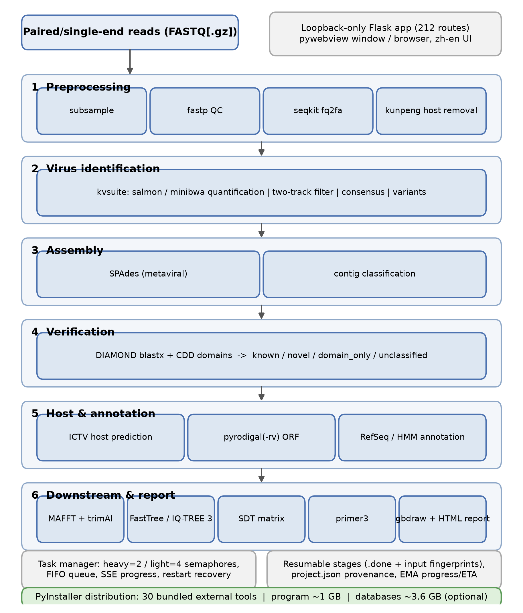
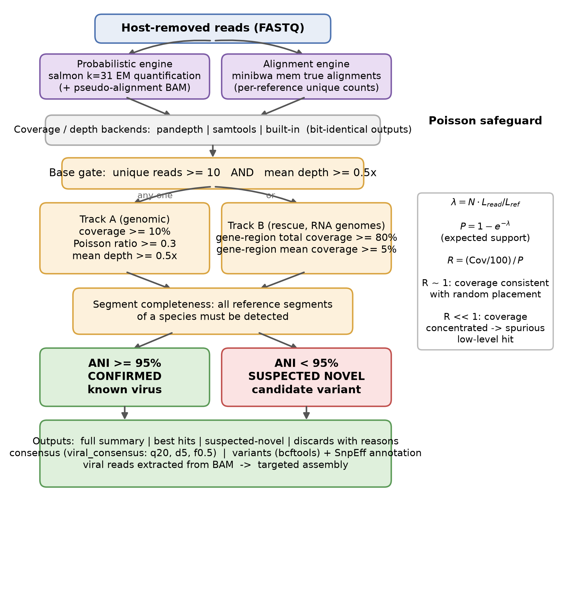
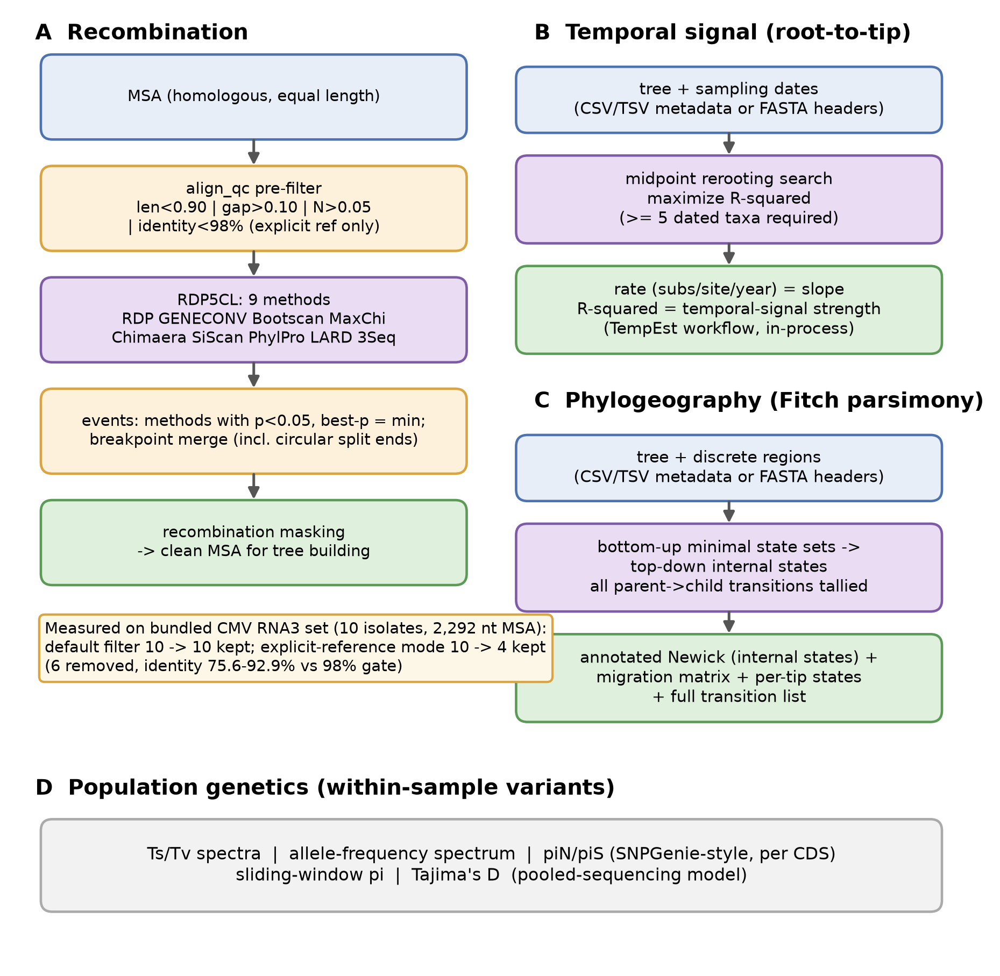
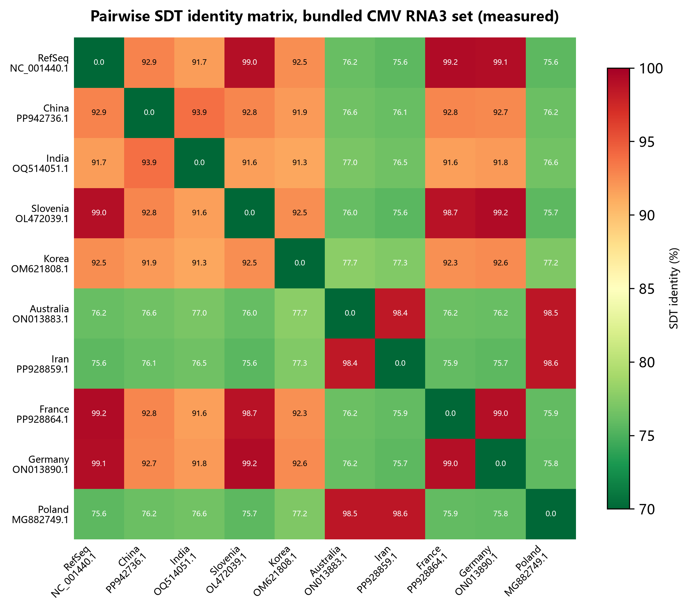

<!-- VirusPlatform manuscript — FINAL (post-review, post-polish). Built 2026-09-15.
     Pipeline artifacts: draft v1 -> review (Major Revision) -> real-data addenda -> revised v2 -> proofread -> this file. -->

# VirusPlatform: an integrated, offline-deployable web platform for end-to-end plant virus detection, quantification, and evolutionary analysis on desktop workstations

**Running title:** VirusPlatform — offline plant virus analytics

**Software version:** VirusPlatform v1.0 (reference database build of 2026-09-09)

**[Author One]^1^, [Author Two]^2^, [Author Three]^1,\*^**

^1^ [Affiliation 1], [City], China
^2^ [Affiliation 2], [City], China
\* Correspondence: [corresponding.author@email]

---

## Abstract

**Background:** Plant viruses cause severe and increasingly globalized crop losses, and high-throughput sequencing (HTS) has become the method of choice for their detection and characterization. The computational workflows used in plant virology nevertheless remain fragmented across dozens of command-line tools designed for Linux servers or cloud environments, leaving many plant quarantine, certification, and breeding laboratories — which typically operate Windows workstations on air-gapped networks — without practical access to end-to-end analysis.

**Results:** Here we present VirusPlatform, an integrated analysis platform whose analytical core runs entirely offline on Windows desktop workstations and packages the full path from raw HTS reads to publication-ready evolutionary inferences. The platform combines (i) a declarative 15-stage pipeline covering quality control, host read removal, known-virus identification and quantification, metagenomic assembly, two-evidence candidate verification, consensus and variant calling, host prediction, open reading frame (ORF) prediction and annotation, phylogenetics, primer design, genome visualization, and HTML reporting; (ii) a curated reference database of 8,464 plant-virus sequences with dual quantification engines (probabilistic expectation–maximization and true-alignment counting) and a Poisson-based statistical safeguard against spurious identifications; (iii) an evolutionary-dynamics module that wraps the nine recombination-detection methods of RDP5, implements dependency-free root-to-tip regression, Fitch-parsimony phylogeographic reconstruction, and within-sample population-genetic estimates; (iv) an epidemiological browser covering approximately 199,000 publicly available plant-virus sequence records with seven analytical views; and (v) optional AI-assisted harmonization of public metadata from NCBI SRA and NGDC GSA — the only networked module, clearly separated from the offline analysis core. The Flask-based application exposes 212 documented routes and 24 pages in a bilingual (Chinese/English) interface, manages concurrent jobs through a two-tier semaphore task engine, and distributes as a one-click PyInstaller package (~1 GB program; 3.6 GB optional database bundle) bundling 30 external bioinformatics tools. On a standard desktop workstation (Intel Core i7-12700K, 64 GB RAM), alignment of a bundled paired-end test set against the full 8,464-reference index completed in 0.17 s after a 3.7 s index build, and a worked recombination-detection demonstration on 10 globally sampled Cucumber mosaic virus (CMV) RNA3 isolates ships with the distribution.

**Conclusions:** VirusPlatform consolidates the complete plant-virus bioinformatics workflow — detection, quantification, verification, evolutionary dynamics, and public-data traceability — into a single desktop application whose analysis core runs offline, lowering the infrastructure and expertise barriers for plant virology laboratories. Independent biological benchmarking on diagnostic panels is identified as the principal outstanding evaluation step.

**Keywords:** plant viruses; viroids; high-throughput sequencing; virus identification; recombination; phylodynamics; phylogeography; web platform; offline deployment

---

## 1. Introduction

Plant viruses are among the most consequential pathogens of cultivated crops: global dimensions of plant virus disease have been reviewed extensively, with yield losses compounded by international trade in vegetative planting material, globalization of seed supply chains, and climate-driven shifts in vector distributions [1,2]. Because a large fraction of plant viruses persist latently or at low titers in symptomless hosts, and because mixed infections are the norm rather than the exception, molecular assays targeting single species are increasingly complemented — and in discovery, quarantine, and certification contexts effectively replaced — by high-throughput sequencing (HTS) [3,4,5]. International frameworks for evaluating viruses discovered by HTS now exist [4], and HTS has become routine in germplasm indexing, certification schemes, and post-entry quarantine [6,5], and plant viral diagnostics continue to advance methodologically [7].

The analytical side of HTS remains a substantial bottleneck. Virus detection in plant HTS data requires a long chain of computational steps — read quality control, host read subtraction, reference-based identification, de novo assembly, candidate verification, consensus generation, and evolutionary analyses — dispersed across command-line utilities written primarily for Linux servers. Early discovery pipelines such as VirusDetect [8] and VirusSeeker [9] automated parts of this chain but were designed either for specific input types (small RNAs) or for cloud deployment. Modern viral-metagenomics pipelines such as ViroProfiler [10] deliver excellent coverage of metagenomic analysis but presuppose container infrastructure and command-line proficiency. At the classification layer, k-mer classifiers such as Kraken 2 [11] and Kaiju [12] and contig-level virus identifiers such as VirSorter2 [13] and geNomad [14] are powerful components, but none of them addresses the downstream evolutionary analyses — recombination, temporal signal, phylogeography, within-sample population genetics — that modern plant virology increasingly demands, and none of them is packaged for non-expert, offline desktop use. Desktop graphical tools for virus genomics exist — BioAider [15] being a prominent example — but focus on post-detection genome analysis rather than the full detection-to-evolution path.

This gap is particularly acute for plant quarantine stations, certification laboratories, and breeding programs, which are overwhelmingly equipped with Windows workstations, often operate on air-gapped or policy-restricted networks (sequence data of regulated pathogens may not legally leave the premises), and rarely employ dedicated bioinformaticians. For these users, neither a collection of Linux scripts nor a cloud service is a viable solution; what is needed is a single application that installs by double-clicking, runs on the hardware they already own, keeps regulated data on-premises, and produces defensible results.

Here we present VirusPlatform, an integrated analysis platform for plant virus HTS data that addresses this gap. Its main contributions are:

1. **A unified 15-stage analytical pipeline** spanning quality control, host removal, known-virus identification and quantification, assembly, candidate verification, consensus and variant calling, host prediction, ORF prediction and functional annotation, phylogenetic analysis, primer design, genome plotting, and HTML reporting, with declarative stage registration, resumable execution, and self-learning progress estimation (Section 2.2, Figure 1).
2. **A curated known-virus identification suite** built on a reference database of 8,464 plant-virus sequences annotated with 26 metadata fields, offering two orthogonal quantification engines (probabilistic and alignment-based), a two-track statistical filtering model with a Poisson expectation safeguard, segment-completeness enforcement for multipartite viruses, and nucleotide-identity-based confirm/novel classification (Section 2.3, Figure 2).
3. **An evolutionary-dynamics module** that wraps all nine recombination-detection methods of RDP5 behind a quality-controlled web workflow, implements dependency-free root-to-tip regression and Fitch-parsimony phylogeographic reconstruction, and provides within-sample population-genetic estimates (Section 2.7–2.8, Figure 3).
4. **Public-data traceability**, including harmonization of NCBI SRA and NGDC GSA metadata into a unified schema with AI-assisted cleaning under a local-rules-first arbitration policy, and a seven-tab epidemiological browser over approximately 199,000 public plant-virus sequence records (Sections 2.9–2.10). This is the platform's only networked functionality and is deliberately separated from the offline analysis core.
5. **Desktop-scale engineering** for non-expert users: a loopback-only Flask server with cross-site-request-forgery and DNS-rebinding protections, a two-tier semaphore task engine with live streaming progress, fully resumable jobs, a bilingual interface, and one-click PyInstaller distribution bundling 30 external bioinformatics tools (Section 2.11).

We describe the implementation (Section 2), report implementation-level measurements and worked demonstrations bundled with the distribution (Section 3), and discuss positioning, design trade-offs, and the explicitly scoped limitations — most importantly the absence, to date, of an independent biological validation campaign (Section 4).

---

## 2. Materials and Methods

### 2.1 Architecture overview

VirusPlatform (v1.0) is implemented as a Python 3.12 application comprising a 96-file core package (51,733 lines of code) organized into an analysis layer (`Virus_Platform_Core`), a Flask-based web layer, and a single-page web front end (25 HTML templates, ~12,900 lines; ~9,500 lines of framework-free JavaScript). The server binds exclusively to the loopback interface (127.0.0.1), probes a predefined port sequence starting at 8765 with random fallback, and validates the Host, Origin, and Referer headers against loopback origins to mitigate cross-site request forgery and DNS-rebinding attacks; destructive endpoints additionally require an explicit confirmation token. The application is explicitly designed for single-workstation, single-analyst use and must not be exposed as a shared network service. All file operations are funneled through path-guarding helpers that reject path traversal outside the platform root, and all external commands execute with argument lists (never a shell), UTF-8/GBK-safe decoding, a default six-hour timeout watchdog (user-configurable), and cooperative cancellation.

Analysis jobs are executed by a task manager that enforces two concurrency tiers — heavy tasks (classification, assembly, annotation, tree building, exact identity matrices; default maximum 2) and light tasks (conversion, plotting, retrieval; default maximum 4) — with FIFO queuing, JSON-persisted task state, and automatic recovery of interrupted tasks on restart. The front end monitors tasks through polling and server-sent events. The user interface is accessible either through an embedded desktop window (pywebview/WebView2) or through the system browser, with automatic fallback, and is fully bilingual (Chinese/English; ~1,856 translation keys per language). The application exposes 212 HTTP routes (24 page-level and 188 programmatic), a count locked by an automated route-inventory regression test.

### 2.2 Analytical pipeline

The end-to-end pipeline (Figure 1) consists of 15 stages registered in a declarative stage table: read subsampling → fastp quality control [16] → FASTQ-to-FASTA conversion (seqkit [17]) → host read removal → known-virus identification (Section 2.3) → metagenomic assembly → candidate verification → consensus and variants → host prediction → ORF prediction → ORF functional annotation → phylogenetics → primer design → genome plotting → HTML report assembly. Stages are grouped in the interface into six workflow modules (preprocessing; virus identification; assembly; host prediction; downstream analysis; reporting).

Stage execution is governed by a dependency registry combined with a stable topological sort, so that any user-selected subset of stages runs in a valid, deterministic order without modification of the executor. Completed stages are marked with sentinel files, enabling resumption of partially completed analyses; the known-virus stage additionally validates reuse of previous results through input fingerprints (path, size, and modification time of reads and reference index), so stale results are never presented as fresh. Every analysis persists a project manifest recording all input files, all parameter values, completed stages, and the last 20 runs, providing auditability at the project level; all runtime dependencies are pinned in a lockfile (`requirements.lock`) for source deployments. Progress reporting uses an exponentially weighted moving-average model of per-stage runtimes (with per-gigabyte normalization for large stages) to display a global progress bar and an estimated time to completion that improves with use.

Host read removal is performed by kunpeng (v0.7.12), a memory-efficient Rust k-mer classifier bundled with the platform, using user-built host indexes; the host index builder fragments long sequences into ≤1 Mb chunks with 34 bp overlaps (k − 1 for the default k = 35), guaranteeing zero k-mer loss at chunk boundaries while keeping memory bounded. Read quality control uses fastp [16]; optional deterministic subsampling takes the first N read pairs to bound runtimes.

A deliberate design pivot shapes the identification stage: early platform versions screened reads with k-mer classification alone (Kraken 2-style [11]), but k-mer abundance does not distinguish a few high-coverage infections from many spurious low-level hits, and multi-mapping reads among close references — common in segmented plant viruses — are apportioned arbitrarily. The platform therefore moved to explicit alignment against a curated, annotated reference database with statistical per-reference filtering (Section 2.3), retaining k-mer classification for host removal and contig triage where its speed is an advantage.

### 2.3 Known-virus identification and quantification suite

#### 2.3.1 Reference database construction and governance

The known-virus suite identifies and quantifies previously characterized plant viruses by aligning reads — prior to assembly — against a curated reference database of 8,464 plant-virus sequences (32.5 MB of sequence). Each reference carries 26 metadata columns, including accession, taxid, NCBI and International Committee on Taxonomy of Viruses (ICTV) species names, segment designation, sequence type, topology, molecule type, completeness, geographic location, host, isolation source, and Virus Metadata Resource (VMR) genus/family/species mappings [18]; taxon identifiers are cross-linked to NCBI taxonomy [19]. Database construction consolidates public plant-virus records with normalization scripts that (i) map raw metadata to the 26-column schema and (ii) harmonize segment designations — 299 distinct raw spellings were observed in public records — into a controlled vocabulary (e.g., DNA-A, RNA2, Segment 1, S/M/L), with context-aware rules for families with lineage-specific nomenclature (e.g., Geminiviridae DNA-A/DNA-B; Nanoviridae DNA-R…DNA-U); the original annotation is preserved in a parallel column. The database ships in a self-contained layout (reference FASTA + annotation table + quantification index + manifest), and the manifest records the build date and configuration of every index; rebuilding through the database-build page regenerates all artifacts and refreshes the ICTV/VMR-derived fields, providing a simple update policy. Database coverage is bounded by public-record availability, a limitation shared by all reference-based approaches.

#### 2.3.2 Dual quantification engines

Two orthogonal quantification engines are provided (Figure 2). The default **probabilistic engine** builds a k = 31 salmon index [20] and estimates per-reference read counts by expectation–maximization, correctly apportioning multi-mapping reads — a property that matters for segmented viruses and species complexes — while simultaneously emitting an alignment BAM for downstream use. The **alignment engine** uses minibwa (a minimal BWA implementation bundled with the platform) to produce true alignments and per-reference counts of uniquely mapped reads read directly from the alignment index. Three interchangeable coverage backends (pandepth, a samtools-based pipeline [21], and a built-in Python implementation) are verified to produce bit-identical coverage and depth estimates on test samples, eliminating tool-dependency drift.

#### 2.3.3 Two-track statistical filtering

Candidate viruses must satisfy a base gate (total mapped reads > 0; unique reads ≥ 10; mean depth ≥ 0.5×) and at least one of two statistical tracks (all thresholds user-configurable):

- **Track A (genomic):** genome coverage ≥ 10%, mean depth ≥ 0.5×, and a Poisson ratio ≥ 0.3. The Poisson ratio compares observed coverage with the coverage expected if reads were distributed independently and uniformly at random along the reference: with λ = N·L~read~/L~ref~ and expected support P = 1 − e^−λ^, the ratio is R = (Coverage/100)/P. R near 1 is consistent with random placement, whereas R ≪ 1 indicates coverage concentrated in a small fraction of the genome — the signature of a spurious low-level hit. The model's uniformity assumption is deliberately conservative (real viral genomes exhibit terminal under-coverage and local coverage variation), so the 0.3 cut-off should be read as a screening heuristic rather than a calibrated test statistic; its sensitivity to real coverage bias is examined empirically in future validation work and in the interim the threshold is exposed for user adjustment.
- **Track B (rescue for compact RNA genomes):** gene-region total coverage ≥ 80% and gene-region average coverage ≥ 5%, allowing detection of compact RNA viruses whose intergenic regions may not be covered.

For multipartite viruses, a species is confirmed only if all of its segments present in the reference database are detected; segment-incomplete detections are excluded from the confirmed table but remain visible, with per-segment detail, in the full summary table, so partial infections are surfaced rather than silently dropped. Every passing reference is classified by read-level average nucleotide identity (ANI) computed from the edit-distance tag as ANI = (aln_len − NM)/aln_len over up to 10,000 sampled alignments per reference: ANI ≥ 95% yields a "confirmed" call, ANI < 95% flags a "suspected novel" variant, and missing ANI (probabilistic engine) is reported as undetermined rather than excluded. Because ICTV species demarcation thresholds vary substantially across virus families, the fixed 95% cut-off is documented as a pragmatic screening heuristic for strain-level novelty rather than a species-boundary test. Outputs comprise a full summary table, a best-hit table, an unclassified/suspected-novel table, and discard lists with per-read reasons; in batch mode, per-sample checkpoint files enable resume, and failed samples are recorded explicitly as "failure ≠ negative".

Consensus sequences are generated through a dedicated realignment chain (minibwa against a single-reference index, followed by viral_consensus with quality ≥ 20, depth ≥ 5, frequency ≥ 0.5, ambiguity = N); variant calling uses bcftools [22] (mpileup with maximum depth 100,000, base quality ≥ 13, BAQ disabled; QUAL ≥ 3.5; minimum frequency 0.05), and single-nucleotide variants (SNVs) and intra-host SNVs are annotated per reference with SnpEff [23], with viroids (which lack coding sequences) detected by nucleotide search in the verification stage and handled gracefully throughout. Viral reads extracted from the identification BAM can serve directly as assembly input, concentrating de novo assembly on viral signal.

### 2.4 Assembly and candidate verification

De novo assembly uses SPAdes [24] in metaviral mode by default (rna and meta modes selectable), with configurable memory (default 64 GB), minimum contig length (default 500 bp), and assembly input (host-removed reads or kvsuite-extracted viral reads). Contigs are classified by kunpeng and filtered by confidence.

Because classification alone does not establish that a contig is a virus, a dedicated verification stage applies two independent lines of evidence: (i) translated search (DIAMOND blastx [25]) against a bundled RefSeq [26] viral protein database, and (ii) conserved-domain confirmation (MMseqs2 [27] against the CDD [28] domain models), combined under a union rule into a four-tier verdict — known, novel (viral but without a clear reference match), domain_only (viral domains without full-length support), and unclassified — plus a separate viroid route by nucleotide BLAST [29]. Unclassified contigs are retained explicitly as the novel-virus candidate pool rather than silently discarded.

### 2.5 Host prediction, ORF prediction, and annotation

Viral host range is predicted by a cascade classifier trained on ICTV host associations [18], cross-validated against NCBI-hosted host metadata with BLAST fallback; results are visualized as Sankey and sunburst diagrams. ORFs are predicted with pyrodigal [30] and its RNA-virus-aware variant pyrodigal-rv [31] (minimum 100 amino acids by default), and ORF sets can be functionally annotated in batch against the RefSeq viral protein database using DIAMOND, MMseqs2, or blastp (database auto-downloaded on first use, ~107 MB), with HMM-based confirmation (pyhmmer/CDD) as fallback; annotation outputs include per-ORF tables, functional category and family distributions, and a GFF3 track. A genome-diagnostic module reports internal stop codons, frameshifts, and completeness issues for annotated genomes.

### 2.6 Phylogenetics and comparative genomics

The phylogenetic stage groups sequences by BLAST top-hit species and, for each group, aligns sequences with MAFFT [32] (auto strategy by default, L-INS-i selectable; Chinese/Japanese/Korean (CJK)-path handling via an ASCII relay directory), trims with trimAl [33] (automated1, with graceful fallback), and infers trees with one of three engines: a dependency-free neighbor-joining implementation over pairwise identity distances, FastTree 2 [34] (GTR+Γ), or IQ-TREE 3 [35,36] with ModelFinder [37] plus dual branch support (ultrafast bootstrap with 1,000 replicates [38]; SH-aLRT with 1,000 replicates [39]), the combination recommended for genomic-era phylogenetic inference [36]. Public NCBI references can be pulled into alignments automatically, with hierarchical reference-sampling strategies (by macro-area, genus, or lineage) adapted from a production quarantine tree pipeline. Two safeguards make the stage robust on desktop hardware: a 25,000 bp reference-length ceiling guards against MAFFT's quadratic memory behavior, and per-species trees prevent biologically uninformative cross-species alignments.

The primer-design module wraps primer3 [40,41] in two modes — full-length tiling and conserved-region targeting — with candidate scoring and optional thermodynamic checks, exporting primer tables for bench use. Comparative genomics tools provide pairwise whole-genome identity in the exact Sequence Demarcation Tool (SDT) v1.3 formulation [42] (re-implemented in pure Python: per-pair alignment with gap-deleted identity, validated against the original tool), nucleotide/amino-acid identity matrices with composite heatmaps, structure comparison with identity/distance matrices, and interactive viewers for multiple alignments, trees, and heatmaps.

### 2.7 Recombination detection

Recombination analysis (Figure 3A) is exposed as a single web workflow that wraps the RDP5 command-line executable [43], which is bundled natively for Windows and implements nine recombination-detection methods: RDP, GENECONV, Bootscan, MaxChi, Chimaera, SiScan, PhylPro, LARD, and 3Seq [44,43].

Because RDP5 requires a homologous, equal-length alignment, an alignment quality-control pre-filter removes sequences failing any of four criteria: un-gapped length ratio < 0.90 relative to the reference (incomplete fragment); gap fraction > 0.10 (poor alignment); ambiguous-base fraction > 0.05 (low quality); and — only when an explicit outgroup reference is designated — pairwise identity < 98% (outlier isolation), computed with the SDT formula [42]. The identity criterion is intentionally gated on explicit reference designation because a 98% line is meaningful only for near-identical (same-outbreak/same-variant) sets: on the bundled demonstration alignment of ten globally sampled CMV RNA3 isolates, applying it with the RefSeq isolate as reference removes 6 of 10 biologically valid isolates (identities 75.6–92.9%), whereas the length/gap/ambiguity criteria alone remove none (Section 3.2). Alignments that are not of equal length, or that retain fewer than four sequences (the RDP5 minimum), are rejected with explicit diagnostics.

RDP5 is invoked with all nine methods, and results are parsed from the evidence table: every event row carries breakpoint coordinates, recombinant/minor/major parent assignments, and per-method p-values; the event-level significance set is defined as the methods reaching p < 0.05 and the best p-value as their minimum. Consistent with RDP5's own guidance [43], detected events should be confirmed by phylogenetic evidence; the module therefore merges all event intervals (including those split across circular-genome ends), masks the corresponding alignment columns to N, and exports the recombination-free "clean" alignment for immediate tree inference. An earlier in-house implementation of three triplet-based methods was removed after benchmarking on synthetic chimeras (six 1 kb sequences, a true breakpoint at position 500) produced 18 detections against 1 true event; RDP5 is now the sole recombination engine, and we report the negative result here as a caution against informal re-implementations of published heuristics. The module ships with a demonstration alignment of globally sampled CMV RNA3 isolates (Section 3.2).

### 2.8 Temporal signal, phylogeography, and population genetics

Three lightweight, dependency-free phylodynamic tools address the questions most frequently asked of plant-virus sequence data — how fast is it evolving, where did it come from, and how is diversity structured — without the computational cost of Bayesian inference frameworks (Figures 3B–3D).

**Root-to-tip regression** quantifies temporal signal and estimates evolutionary rate, reproducing the TempEst [45] workflow in-process. Sequences with sampling dates (parsed from CSV/TSV metadata or FASTA headers of the form `accession|location|year`) are placed on a tree viewed as an unrooted graph; the algorithm evaluates all midpoint rerootings and selects the root position maximizing R². The regression slope estimates the substitution rate (substitutions/site/year) and R² measures the strength of temporal structure; at least five dated taxa are required.

**Phylogeographic reconstruction** assigns discrete geographic states to a tree using Fitch maximum parsimony [46]: a bottom-up pass computes the minimal state set at each internal node, a top-down pass fixes internal states, and all parent→child transitions are tallied into a migration matrix. Outputs comprise an annotated Newick tree (internal nodes labeled with inferred regions), the transition matrix, a per-tip state table, and a full transition list, which together support spread-history narratives without multi-day Bayesian runtimes; downstream TreeTime [47] analysis remains available for users requiring time calibration.

**Within-sample population genetics** computes, from the per-sample variant catalogs, transition/transversion spectra, allele-frequency spectra, π~N~/π~S~ (dN/dS) per coding region under a pooled-sequencing model, sliding-window nucleotide diversity (π), and Tajima's D, enabling selective-pressure and demographic screening of intra-host viral populations.

### 2.9 Public metadata integration (optional networked module)

Interpreting viral sequence diversity requires sample metadata that public repositories store heterogeneously. VirusPlatform harmonizes metadata from two repositories — the NCBI Sequence Read Archive (SRA) [48,49] (E-utilities; 18 extraction dimensions including run, release/collection dates, location, source, tissue, host age/growth stage, library source, BioProject, and PMID) and the National Genomics Data Center's Genome Sequence Archive (GSA; NGDC) [50] (10 dimensions; HTML and Excel endpoints parsed with retry/backoff and on-disk caching) — into a unified 14-column schema, with Genome Warehouse [51] and Europe PMC [52] used for BioProject-level and literature provenance, respectively. Location strings are normalized to a three-level `country, province, city` format.

This module is the platform's **only networked component**, a boundary made explicit in both code and documentation: the analysis core (Sections 2.2–2.8) never performs network I/O, and public-data retrieval degrades gracefully to cached results when offline. Metadata cleaning can be assisted by large-language-model services (OpenAI-compatible APIs; DeepSeek and Kimi endpoints are preconfigured) but operates **only when the user explicitly configures an API key** — an act that sends repository metadata (never local sequencing data) to the chosen provider, a trade-off the documentation states plainly. Under the arbitration policy, locally extracted fields always take precedence over model output; the model may only fill gaps and reformat; a sanitizer layer permits only subtraction, relocation, and reformatting — never fabrication; and every AI-touched field carries a provenance suffix for manual review. An optional interactive report generator (datavzrd) renders cleaned metadata as browsable tables.

### 2.10 The seven-tab epidemiological browser

A server-rendered virus explorer provides seven coordinated analytical views over a pre-built database of approximately 199,000 publicly available plant-virus sequence records: spatiotemporal trend analysis (time series by taxonomy and geography), whole-genome mutation browsing, a filterable record table (capped at 5,000 rows with an explicit truncation notice), a primer database, host-range summaries, vector-transmission summaries, and per-virus profile pages. The module originated as a Dash application with 13 callbacks and was re-engineered as 13 native Flask JSON endpoints, eliminating the Dash runtime from the packaged application while preserving behavior.

### 2.11 Distribution, packaging, and quality assurance

The platform is distributed as a PyInstaller onedir bundle (`VirusPlatform.exe`) that embeds the Python runtime, the web front end (including the Plotly bundle for offline charting and tree/heatmap viewers), and 30 precompiled external tools; the pinned versions of key bundled tools are listed in Table 3. Distribution follows a three-part layout — program (~1 GB), example datasets (~1 MB), and optional reference databases (~3.6 GB) — with an automated post-build self-check (`--cli selfcheck`) that verifies tool executability inside the packaged artifact; aggressive exclusion of scientific-Python transitive dependencies reduced the first-build artifact from 2.05 GB.

Quality assurance relies on an automated suite of 85 Python test scripts: 30 end-to-end integration tests (covering alignment, annotation, asynchronous UI behavior, background tasks, comparisons, concurrency, downloads, navigation, phylogenetics, submission, and more), 20 static/dynamic check scripts (route inventories, database paths, example manifests, console errors, interface-language verification), and 4 unit-test modules, plus audit, probe, and route-baseline guard scripts that lock the 212-endpoint surface against accidental change. Eighteen example inputs (paired-end reads; Cucumber mosaic virus, Potato virus Y, and Tobacco mosaic virus genomes; a Potato spindle tuber viroid; multi-isolate sets; a CMV RNA3 global recombination set; Newick trees) and 26 curated example result sets are bundled and browsable in the interface, serving both as documentation and as regression fixtures. Maintenance of a 51,733-line core with 30 bundled third-party binaries is a real liability; the mitigation strategy combines version-pinned tool manifests, database manifests with recorded build dates, the post-build self-check, and the test estate, with a stated policy of rebuilding the bundle whenever an upstream tool with a security or correctness fix is released.

---

## 3. Results

### 3.1 Platform inventory

Table 1 summarizes the analytical surface. The 15-stage pipeline covers the complete detection-to-evolution path; the 25 registered standalone tools (Table 2) cover workflows outside the linear pipeline, including format conversion, dsRNA design, exact SDT analysis, recombination, phylogeography, temporal-signal testing, and two one-click composite chains (a four-step identification-classification chain and a five-module quantification-consensus chain) that serialize multiple tools into single reproducible runs with symbolic-link result aggregation.

**Table 1.** The 15-stage analytical pipeline.

| Stage | Function | Key tools | Representative outputs |
|---|---|---|---|
| subsample | Deterministic read subsampling | — | sub_R1/R2.fastq.gz |
| fastp | Read QC and filtering | fastp [16] | clean reads, QC report |
| fq2fa | FASTQ→FASTA | seqkit [17] | conv_R1/R2.fa.gz |
| host | Host read removal | kunpeng | kept reads, host fraction |
| kvsuite | Known-virus ID and quantification | salmon [20] / minibwa | identification tables, BAM, viral reads |
| assembly | Metagenomic assembly and contig classification | SPAdes [24], kunpeng, BLAST [29] | contigs, classification TSV |
| verify | Candidate verification (two-evidence) | DIAMOND [25], MMseqs2 [27], CDD [28] | calls.tsv (known/novel/domain_only/unclassified/viroid) |
| consensus | Consensus and variants | minimap2 [53], viral_consensus, bcftools [22] | consensus.fa, variants.tsv |
| hostana | Viral host prediction | ICTV cascade [18] | host_prediction.tsv, Sankey/sunburst |
| orf | ORF prediction | pyrodigal(-rv) [30] | faa/ffn/gff |
| orfa | ORF functional annotation | DIAMOND/MMseqs2/blastp + HMM | orf_annotation.tsv, GFF3 |
| phylo | Alignment, tree, identity matrix | MAFFT [32], trimAl [33], FastTree [34] / IQ-TREE [35] | tree.nwk, SDT matrix |
| primer | Primer design | primer3 [40,41] | primers.tsv |
| gbdraw | Genome plots | gbdraw / DNA Features Viewer | SVG circular/linear plots |
| report | HTML report | Plotly, pycirclize | report.html |

**Table 2.** The 25 standalone analysis tools, grouped by category.

| Category | Tools |
|---|---|
| Read processing | convert, fastp, hostremoval |
| Identification & classification | identify, assemble, contigs, verify, kvsuite; composite chain kvchain |
| Genome analysis | consensus, orf, orfa, genoplot, primer, dsrna |
| Comparative genomics | structcmp, sdt (exact SDT), identity, align, quicktree |
| Evolutionary dynamics | rdp (RDP5 nine methods), rtt (temporal signal), phylogeo (Fitch) |
| Composite chains | virchain (identification–classification chain), kvchain (quantification–consensus chain) |

**Table 3.** Pinned versions of selected bundled tools (full manifest in the distribution).

| Tool | Version | Tool | Version |
|---|---|---|---|
| kunpeng | 0.7.12 | samtools/bcftools | 1.24 (bcftools) |
| IQ-TREE | 3.0.1 | biopython | 1.88 |
| pyrodigal | 3.7.1 | Flask | 3.1.3 |
| pyrodigal-rv | 0.1.0 | polars | 1.44.2 |
| pyhmmer | 0.12.3 | plotly | 7.0.0 |
| primer3-py | 2.2.0 | pywebview | 6.2.1 |

### 3.2 Worked demonstrations and reproducible benchmarks

To make the platform's behavior concrete and independently checkable, the distribution bundles worked demonstrations, and we report the following measurements performed with the shipped code on a documented workstation (Intel Core i7-12700K, 20 logical cores, 64 GB RAM, Windows 11, Python 3.12.10; 8 threads unless noted). All numbers below are reproducible from the bundled example data; analysis scripts accompany the manuscript.

**Alignment benchmark.** Against the full 8,464-reference index (32.5 MB of sequence), the minibwa engine built its index in 3.73 s and aligned the bundled paired-end example set (3,600 read pairs; all 7,200 records recovered alignments) in 0.17 s — approximately 20,600 read pairs per second at 8 threads. As an internal development benchmark, a mock mixed-virus sample previously completed the full five-module known-virus workflow (identification → filtering → consensus → plotting → variant calling) in 7.9 s against the same index. We emphasize that these are engineering benchmarks of throughput, not diagnostic performance.

**Recombination pre-filter demonstration.** On the bundled CMV RNA3 alignment (10 isolates from China, India, Slovenia, South Korea, Australia, Iran, France, Germany, Poland, and the RefSeq reference NC_001440.1; 2,292 alignment columns), the default pre-filter (length/gap/ambiguity criteria, identity criterion disabled) retained all 10 isolates, while explicit-reference mode (reference NC_001440.1, 98% identity gate) retained 4 and removed 6 isolates with pairwise identities of 75.6–92.9% — the documented behavior for non-outbreak datasets and the reason the identity criterion is reference-gated. The full pairwise SDT identity matrix computed from this alignment ranged from 75.6% to 99.2% (mean against the RefSeq reference 89.1%), consistent with the known diversity of CMV subgroup representatives on RNA3 (Figure 4). The same alignment serves as input for the complete RDP5 workflow.

**Verification of measurement integrity.** The three coverage backends produced bit-identical coverage and depth outputs on all tested samples; the route-inventory guard confirms the 212-endpoint API surface; and the post-build self-check verifies executability of all 30 bundled tools inside the packaged artifact.

We state explicitly that Section 3 reports implementation-level evidence only. Sensitivity, specificity, and limit-of-detection against diagnostic (e.g., RT-PCR) ground truth, and comparison against alternative pipelines on a common panel of plant-virus HTS datasets, constitute the planned independent validation campaign and are not claimed here.

### 3.3 Quality assurance and distribution footprint

The automated test estate comprises 85 scripts (30 integration, 20 check, 4 unit, plus audit/probe/guard scripts) that run against both source and packaged builds; the 26 curated example result sets are regenerated by scripts and exposed through a read-only API, doubling as visual regression fixtures. Because VirusPlatform is intended as a defensible diagnostic aid, all identification thresholds, filtering decisions, and discard reasons are emitted as machine-readable tables — including per-sample failure records with "failure ≠ negative" semantics — supporting downstream audit. The three-part distribution (program ~1 GB; examples ~1 MB; databases ~3.6 GB) installs by extraction on any Windows 10/11 x64 workstation without administrator rights, Python installation, or network access; the application starts in desktop-window or browser mode, probes ports automatically, and self-verifies on first run.

---

## 4. Discussion

VirusPlatform demonstrates that the complete plant-virus HTS analysis path — from raw reads to recombination-aware, phylogeographically contextualized inferences — can be packaged as a single desktop application whose analysis core runs offline. Its design responds to four constraints that distinguish plant quarantine and certification laboratories from the sequencing centers for which most viroinformatics software is written: Windows-only workstation estates, air-gapped or policy-restricted networks, absence of dedicated bioinformaticians, and regulatory demands for auditable, reproducible decisions.

**Positioning.** Relative to discovery pipelines such as VirusDetect [8] and VirusSeeker [9], VirusPlatform extends coverage from detection through evolutionary analysis; relative to containerized virome pipelines such as ViroProfiler [10], it trades multi-tenant scalability for zero-infrastructure operability — a deliberate choice because locked-down government workstations frequently prohibit container runtimes and virtualization, making a native Windows bundle the path of least resistance for this user base; relative to desktop tools such as BioAider [15], it adds the entire upstream detection/quantification path and a job-managed, sample-centric data model. At the component level, VirusPlatform is complementary to, not competitive with, k-mer classifiers [11,12] and contig-level virus identifiers [13,14]: it uses k-mer classification where speed dominates (host removal, contig triage) and reference alignment where statistical defensibility dominates (detection and quantification). The known-virus suite's dual-engine arrangement — a probabilistic engine that apportions multi-mapping reads among close references, an alignment engine that provides count auditability, and a Poisson-ratio safeguard that converts the classic low-level-hit ambiguity into an explicit statistical criterion — is, to the best of our knowledge, not available as such in existing plant-virus platforms.

**Design trade-offs.** Three choices merit discussion. First, recombination detection deliberately wraps RDP5's nine methods [43] rather than reimplementing them: our in-house prototype of triplet-based methods produced 18 detections against one true event on synthetic chimeras and was removed — a negative result we report as a caution against informal re-implementations. Second, phylodynamics favors parsimony and regression over Bayesian inference: Fitch reconstruction and root-to-tip regression answer the operational questions (rate, direction of spread) in seconds on desktop hardware, whereas Bayesian phylogeography would impose runtimes and configuration expertise incompatible with the target users; TreeTime integration remains available for time calibration. Third, the platform ships as a loopback-only single-user application without authentication: it is designed for one workstation, one analyst, and on-premises data, and we state this explicitly to prevent misdeployment as a shared web service. The only networked component — public metadata retrieval with optional AI-assisted cleaning — is separated from the analysis core, requires explicit user configuration, and never transmits local sequencing data.

**Limitations.** The evaluation presented here is deliberately scoped as an implementation evaluation: performance figures derive from reproducible engineering benchmarks and the test estate, not from a biological validation campaign, and we regard independent benchmarking on real plant-virus HTS panels — sensitivity/specificity against diagnostic ground truth and head-to-head comparison with alternative pipelines — as the single most important next step before diagnostic use. The platform currently targets short-read data; native long-read (ONT) workflows and quasispecies reconstruction beyond SNV-level variant calling are not yet integrated. Reference-based identification is bounded by database coverage: 8,464 curated references with ICTV/VMR-linked metadata mitigate, but cannot eliminate, discovery bias against unstudied viral lineages; the Poisson safeguard's threshold, the two-track cut-offs, and the 95% ANI line are screening heuristics whose calibration across virus families awaits the validation campaign. Finally, AI-assisted metadata cleaning, although arbitration-guarded and subtraction-only, can in principle propagate upstream metadata errors; all AI-touched fields remain provenance-flagged for manual review.

**Future work.** Planned extensions include the independent biological validation study; a validated ONT pipeline; integration of time-calibrated phylogenetic inference behind the existing task engine; a server mode with authentication for multi-user laboratory deployments; automated monthly reconciliation of the reference database against ICTV releases; and a structured usability evaluation with target users in quarantine and certification laboratories, which we have so far supported only with bundled worked examples and bilingual documentation.

---

## 5. Conclusion

VirusPlatform integrates detection, quantification, verification, comparative genomics, and evolutionary dynamics for plant virus HTS data into a single desktop application with a statistical identification model, wrapped RDP5 recombination analysis, dependency-free phylodynamics, harmonized public metadata, and one-click distribution — with an analysis core that runs fully offline on the Windows workstations that plant quarantine and certification laboratories already own. By matching the actual infrastructure and expertise constraints of its target users, it lowers the barrier between HTS data and defensible virological conclusions; independent biological validation is the identified gate between implementation and diagnostic use.

---

## Figure legends

**Figure 1. VirusPlatform architecture and the 15-stage pipeline.** Paired or single-end FASTQ input enters six stage groups (preprocessing; virus identification; assembly; verification; host & annotation; downstream & report) executed by a dependency-aware, resumable stage engine. The loopback-only Flask shell exposes 212 routes in a bilingual interface; a two-tier task manager (heavy = 2, light = 4 concurrent jobs) provides queued, streaming, restart-safe execution; the PyInstaller distribution bundles 30 external tools in a three-part layout (program ~1 GB; examples ~1 MB; databases ~3.6 GB optional).

**Figure 2. Known-virus identification and quantification suite.** Reads are quantified against 8,464 curated plant-virus references by either the probabilistic engine (salmon k = 31 expectation–maximization, multi-mapping reads apportioned probabilistically) or the alignment engine (minibwa, true alignments with per-reference unique counts); three interchangeable coverage backends yield bit-identical outputs. Candidates must pass a base gate and at least one of two statistical tracks (Track A: genomic coverage, depth, and Poisson ratio safeguard; Track B: gene-region rescue for compact RNA genomes), segment completeness for multipartite viruses, and are classified by read-level ANI (≥ 95% confirmed; < 95% suspected novel). Outputs include per-decision machine-readable tables, consensus (viral_consensus), and variant catalogs (bcftools + SnpEff).

**Figure 3. Evolutionary-dynamics module.** (A) Recombination workflow: alignment quality-control pre-filter (length/gap/ambiguity criteria; identity criterion only with an explicit reference), RDP5 nine-method detection, event table (methods with p < 0.05; best p-value as minimum), interval merging including circular split ends, and recombination masking to a clean alignment for tree building. Inset: measured behavior on the bundled 10-isolate CMV RNA3 alignment. (B) Root-to-tip regression: midpoint rerooting search maximizing R²; slope estimates substitutions/site/year. (C) Fitch-parsimony phylogeography: bottom-up/top-down state reconstruction yielding an annotated tree, migration matrix, and transition lists. (D) Within-sample population genetics: Ts/Tv spectra, allele-frequency spectra, π~N~/π~S~ per coding region, sliding-window π, and Tajima's D under a pooled-sequencing model.

**Figure 4. Pairwise SDT identity matrix of the bundled CMV RNA3 demonstration set (measured).** Computed with the platform's own formulation from the bundled example alignment (10 global isolates; 2,292 columns). The matrix shows clear block structure (75.6–99.2%; mean vs. the RefSeq reference 89.1%) consistent with known CMV subgroup diversity on RNA3: within-subgroup identities of 98–99% (RefSeq–France–Germany–Slovenia; Australia–Iran–Poland), approximately 75–77% between subgroups, and intermediate 91–93% identities of the China, India, and South Korea isolates to the RefSeq reference. The demonstration also illustrates why the 98% identity criterion is gated on an explicit reference: used with the RefSeq isolate as reference, it would remove the six cross-subgroup isolates.

---

## Availability and requirements

- **Project name:** VirusPlatform (v1.0; plant-virus reference database build of 2026-09-09).
- **Operating system:** Windows 10/11 x64; Python 3.12 for source deployment (dependencies pinned in `requirements.lock`).
- **Programming languages:** Python 3.12; framework-free JavaScript front end; 30 bundled precompiled third-party tools.
- **Source-code availability:** The complete source code will be deposited in a public repository (GitHub) and archived on Zenodo with a DOI upon acceptance; the reference database build manifest ships with the distribution.
- **Example data:** 18 example inputs and 26 curated example result sets ship with the distribution; the CMV RNA3 recombination demonstration set uses public RefSeq/GenBank sequences (NC_001440.1 and accessions PP942736.1, OQ514051.1, OL472039.1, OM621808.1, ON013883.1, PP928859.1, PP928864.1, ON013890.1, MG882749.1).
- **Any restrictions to use by non-academics:** none planned; final license to be stated with the code deposit.

## Abbreviations

HTS: high-throughput sequencing; ANI: average nucleotide identity; ORF: open reading frame; SDT: Sequence Demarcation Tool; RTT: root-to-tip; SRA: Sequence Read Archive; GSA: Genome Sequence Archive; VMR: Virus Metadata Resource; ICTV: International Committee on Taxonomy of Viruses; SNV/iSNV: single nucleotide variant / intra-host SNV; EM: expectation–maximization.

## Acknowledgements

[To be completed.]

## Author contributions

[To be completed.]

## Conflict of interest

The authors declare that the research was conducted in the absence of any commercial or financial relationships that could be construed as a potential conflict of interest.

## References

1. Anderson PK, Cunningham AA, Patel NG, Morales FJ, Epstein PR, Daszak P. Emerging infectious diseases of plants: pathogen pollution, climate change and agrotechnology drivers. Trends Ecol Evol. 2004;19(10):535-544. doi:10.1016/j.tree.2004.07.021
2. Jones RAC, Naidu RA. Global dimensions of plant virus diseases: current status and future perspectives. Annu Rev Virol. 2019;6(1):387-409. doi:10.1146/annurev-virology-092818-015606
3. Hadidi A, Flores R, Candresse T, Barba M. Next-generation sequencing and genome editing in plant virology. Front Microbiol. 2016;7:1325. doi:10.3389/fmicb.2016.01325
4. Massart S, Candresse T, Gil J, Lacomme C, Predajna L, Ravnikar M, et al. A framework for the evaluation of biosecurity, commercial, regulatory, and scientific impacts of plant viruses and viroids identified by NGS technologies. Front Microbiol. 2017;8:45. doi:10.3389/fmicb.2017.00045
5. Villamor DEV, Ho T, Al Rwahnih M, Martin RR, Tzanetakis IE. High throughput sequencing for plant virus detection and discovery. Phytopathology. 2019;109(5):716-725. doi:10.1094/PHYTO-07-18-0257-RVW
6. Maliogka VI, Minafra A, Saldarelli P, Ruiz-Garcia AB, Glasa M, Katis N, Olmos A. Recent advances on detection and characterization of fruit tree viruses using high-throughput sequencing technologies. Viruses. 2018;10(8):436. doi:10.3390/v10080436
7. Kanapiya A, Amanbayeva U, Tulegenova Z, et al. Recent advances and challenges in plant viral diagnostics. Front Plant Sci. 2024;15:1451790. doi:10.3389/fpls.2024.1451790
8. Zheng Y, Gao S, Padmanabhan C, et al. VirusDetect: an automated pipeline for efficient virus discovery using deep sequencing of small RNAs. Virology. 2017;500:130-138. doi:10.1016/j.virol.2016.10.017
9. Zhao G, Wu G, Lim ES, Droit L, Krishnamurthy S, Barouch DH, Virgin HW, Wang D. VirusSeeker, a computational pipeline for virus discovery and virome composition analysis. Virology. 2017;503:21-30. doi:10.1016/j.virol.2017.01.005
10. Ru J, Khan Mirzaei M, Xue J, Peng X, Deng L. ViroProfiler: a containerized bioinformatics pipeline for viral metagenomic data analysis. Gut Microbes. 2023;15(1):2192522. doi:10.1080/19490976.2023.2192522
11. Wood DE, Lu J, Langmead B. Improved metagenomic analysis with Kraken 2. Genome Biol. 2019;20(1):257. doi:10.1186/s13059-019-1891-0
12. Menzel P, Ng KL, Krogh A. Fast and sensitive taxonomic classification for metagenomics with Kaiju. Nat Commun. 2016;7:11257. doi:10.1038/ncomms11257
13. Guo J, Bolduc B, Zayed AA, et al. VirSorter2: a multi-classifier, expert-guided approach to detect diverse DNA and RNA viruses in metagenomic samples. Microbiome. 2021;9(1):37. doi:10.1186/s40168-020-00990-y
14. Camargo AP, Roux S, Schulz F, et al. Identification of mobile genetic elements with geNomad. Nat Biotechnol. 2024;42(8):1303-1312. doi:10.1038/s41587-023-01953-y
15. Zhou ZJ, Qiu Y, Pu Y, Huang X, Ge XY. BioAider: an efficient tool for viral genome analysis and its application in tracing SARS-CoV-2 transmission. Sustain Cities Soc. 2020;63:102466. doi:10.1016/j.scs.2020.102466
16. Chen S, Zhou Y, Chen Y, Gu J. fastp: an ultra-fast all-in-one FASTQ preprocessor. Bioinformatics. 2018;34(17):i884-i890. doi:10.1093/bioinformatics/bty560
17. Shen W, Le S, Li Y, Hu F. SeqKit: a cross-platform and ultrafast toolkit for FASTA/Q file processing. PLoS One. 2016;11(10):e0163962. doi:10.1371/journal.pone.0163962
18. Lefkowitz EJ, Dempsey DM, Hendrickson RC, Orton RJ, Siddell SG, Smith DB. Virus taxonomy: the database of the International Committee on Taxonomy of Viruses (ICTV). Nucleic Acids Res. 2018;46(D1):D708-D717. doi:10.1093/nar/gkx932
19. Hatcher EL, Zhdanov SA, Bao Y, et al. Virus Variation Resource - improved response to emergent viral outbreaks. Nucleic Acids Res. 2017;45(D1):D482-D490. doi:10.1093/nar/gkw1065
20. Patro R, Duggal G, Love MI, Irizarry RA, Kingsford C. Salmon provides fast and bias-aware quantification of transcript expression. Nat Methods. 2017;14(4):417-419. doi:10.1038/nmeth.4197
21. Li H, Handsaker B, Wysoker A, et al. The Sequence Alignment/Map format and SAMtools. Bioinformatics. 2009;25(16):2078-2079. doi:10.1093/bioinformatics/btp352
22. Danecek P, Bonfield JK, Liddle J, et al. Twelve years of SAMtools and BCFtools. Gigascience. 2021;10(2):giab008. doi:10.1093/gigascience/giab008
23. Cingolani P, Platts A, Wang LL, et al. A program for annotating and predicting the effects of single nucleotide polymorphisms, SnpEff: SNPs in the genome of Drosophila melanogaster strain w1118; iso-2; iso-3. Fly (Austin). 2012;6(2):80-92. doi:10.4161/fly.19695
24. Bankevich A, Nurk S, Antipov D, et al. SPAdes: a new genome assembly algorithm and its applications to single-cell sequencing. J Comput Biol. 2012;19(5):455-477. doi:10.1089/cmb.2012.0021
25. Buchfink B, Xie C, Huson DH. Fast and sensitive protein alignment using DIAMOND. Nat Methods. 2015;12(1):59-60. doi:10.1038/nmeth.3176
26. O'Leary NA, Wright MW, Brister JR, et al. Reference sequence (RefSeq) database at NCBI: current status, taxonomic expansion, and functional annotation. Nucleic Acids Res. 2016;44(D1):D733-D745. doi:10.1093/nar/gkv1189
27. Steinegger M, Soding J. MMseqs2 enables sensitive protein sequence searching for the analysis of massive data sets. Nat Biotechnol. 2017;35(11):1026-1028. doi:10.1038/nbt.3988
28. Lu S, Wang J, Chitsaz F, et al. CDD/SPARCLE: the conserved domain database in 2020. Nucleic Acids Res. 2020;48(D1):D265-D268. doi:10.1093/nar/gkz991
29. Camacho C, Coulouris G, Avagyan V, et al. BLAST+: architecture and applications. BMC Bioinformatics. 2009;10:421. doi:10.1186/1471-2105-10-421
30. Larralde M. Pyrodigal: Python bindings and interface to Prodigal, an efficient method for gene prediction in prokaryotes. J Open Source Softw. 2022;7(72):4296. doi:10.21105/joss.04296
31. De Coninck L. pyrodigal-rv: RNA-virus-aware gene prediction based on Pyrodigal [Computer software, v0.1.0]. GitHub. https://github.com/LanderDC/pyrodigal-rv
32. Katoh K, Standley DM. MAFFT multiple sequence alignment software version 7: improvements in performance and usability. Mol Biol Evol. 2013;30(4):772-780. doi:10.1093/molbev/mst010
33. Capella-Gutierrez S, Silla-Martinez JM, Gabaldon T. trimAl: a tool for automated alignment trimming in large-scale phylogenetic analyses. Bioinformatics. 2009;25(15):1972-1973. doi:10.1093/bioinformatics/btp348
34. Price MN, Dehal PS, Arkin AP. FastTree 2 - approximately maximum-likelihood trees for large alignments. PLoS One. 2010;5(3):e9490. doi:10.1371/journal.pone.0009490
35. Nguyen LT, Schmidt HA, von Haeseler A, Minh BQ. IQ-TREE: a fast and effective stochastic algorithm for estimating maximum-likelihood phylogenies. Mol Biol Evol. 2015;32(1):268-274. doi:10.1093/molbev/msu300
36. Minh BQ, Schmidt HA, Chernomor O, et al. IQ-TREE 2: new models and efficient methods for phylogenetic inference in the genomic era. Mol Biol Evol. 2020;37(5):1530-1534. doi:10.1093/molbev/msaa015
37. Kalyaanamoorthy S, Minh BQ, Wong TKF, von Haeseler A, Jermiin LS. ModelFinder: fast model selection for accurate phylogenetic estimates. Nat Methods. 2017;14(6):587-589. doi:10.1038/nmeth.4285
38. Hoang DT, Chernomor O, von Haeseler A, Minh BQ, Vinh LS. UFBoot2: improving the ultrafast bootstrap approximation. Mol Biol Evol. 2018;35(2):518-522. doi:10.1093/molbev/msx281
39. Guindon S, Dufayard JF, Lefort V, Anisimova M, Hordijk W, Gascuel O. New algorithms and methods to estimate maximum-likelihood phylogenies: assessing the performance of PhyML 3.0. Syst Biol. 2010;59(3):307-321. doi:10.1093/sysbio/syq010
40. Koressaar T, Remm M. Enhancements and modifications of primer design program Primer3. Bioinformatics. 2007;23(10):1289-1291. doi:10.1093/bioinformatics/btm091
41. Untergasser A, Cutcutache I, Koressaar T, Ye J, Faircloth BC, Remm M, Rozen SG. Primer3 - new capabilities and interfaces. Nucleic Acids Res. 2012;40(15):e115. doi:10.1093/nar/gks596
42. Muhire BM, Varsani A, Martin DP. SDT: a virus classification tool based on pairwise sequence alignment and identity calculation. PLoS One. 2014;9(9):e108277. doi:10.1371/journal.pone.0108277
43. Martin DP, Varsani A, Roumagnac P, Botha G, Maslamoney S, Schwab T, Kelz Z, Kumar V, Murrell B. RDP5: a computer program for analyzing recombination in, and removing signals of recombination from, nucleotide sequence datasets. Virus Evol. 2021;7(1):veaa087. doi:10.1093/ve/veaa087
44. Martin DP, Murrell B, Golden M, Khoosal A, Muhire B. RDP4: detection and analysis of recombination patterns in virus genomes. Virus Evol. 2015;1(1):vev003. doi:10.1093/ve/vev003
45. Rambaut A, Lam TT, Carvalho LM, Pybus OG. Exploring the temporal structure of heterochronous sequences using TempEst (formerly Path-O-Gen). Virus Evol. 2016;2(1):vew007. doi:10.1093/ve/vew007
46. Fitch WM. Toward defining the course of evolution: minimum change for a specific tree topology. Syst Zool. 1971;20(4):406-416. doi:10.2307/2412116
47. Sagulenko P, Puller V, Neher RA. TreeTime: maximum-likelihood phylodynamic analysis. Virus Evol. 2018;4(1):vex042. doi:10.1093/ve/vex042
48. Leinonen R, Sugawara H, Shumway M; International Nucleotide Sequence Database Collaboration. The Sequence Read Archive. Nucleic Acids Res. 2011;39(Database issue):D19-D21. doi:10.1093/nar/gkq1019
49. Katz K, Shutov O, Lapoint R, Kimelman M, Brister JR, O'Sullivan C. The Sequence Read Archive: a decade more of explosive growth. Nucleic Acids Res. 2022;50(D1):D387-D390. doi:10.1093/nar/gkab1053
50. CNCB-NGDC Members and Partners. Database resources of the National Genomics Data Center, China National Center for Bioinformation in 2026. Nucleic Acids Res. 2026;54(D1):D28-D47. doi:10.1093/nar/gkaf1172
51. Chen M, Ma Y, Wu S, et al. Genome Warehouse: a public repository housing genome-scale data. Genomics Proteomics Bioinformatics. 2021;19(4):584-589. doi:10.1016/j.gpb.2021.04.001
52. Europe PMC Consortium. Europe PMC: a full-text literature database for the life sciences and platform for innovation. Nucleic Acids Res. 2015;43(D1):D1042-D1048. doi:10.1093/nar/gku1061
53. Li H. Minimap2: pairwise alignment for nucleotide sequences. Bioinformatics. 2018;34(18):3094-3100. doi:10.1093/bioinformatics/bty191
