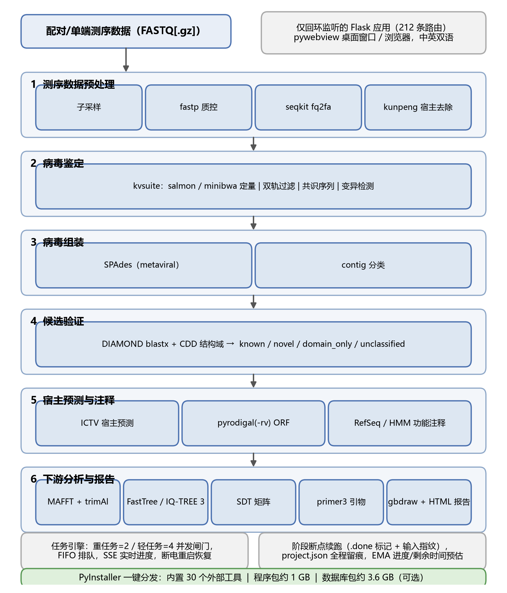
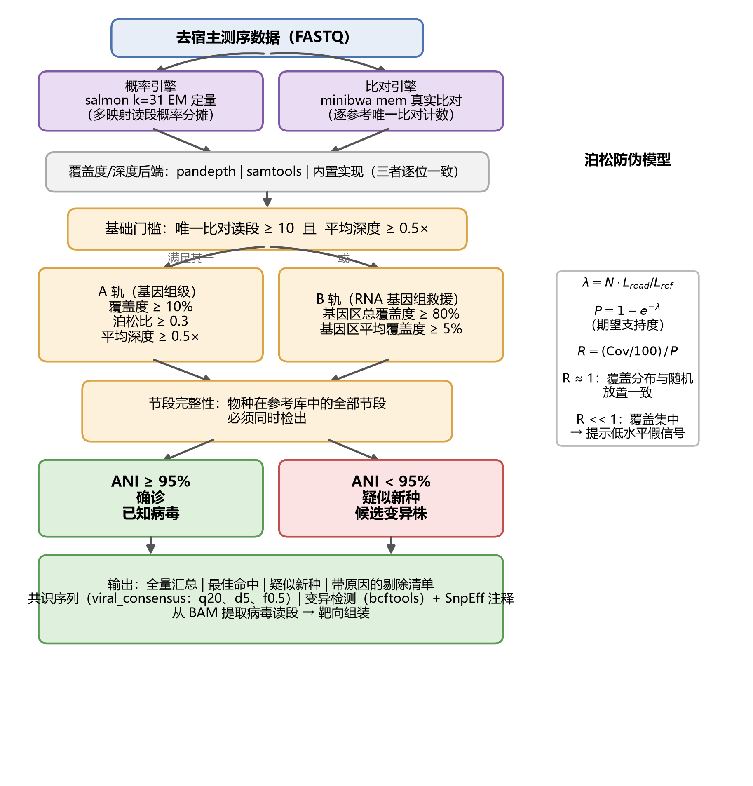

# VirusPlatform：MMPV 植物病毒发现平台的桌面化离线实现

**软件版本：** VirusPlatform v1.0（参考数据库构建日期 2026-09-09）

**[作者一]1，[作者二]2，[作者三]1,\***

1 [单位一]，[城市]，中国
2 [单位二]，[城市]，中国
\* 通讯作者：[email]

## 摘要

服务器版平台 MMPV 已将基准驱动的植物病毒发现流程标准化，但其 Kraken2 加比对工具的两步宿主过滤、多工具鉴定集成与跨样本并行体系，预设了集群级的内存与线程资源，无法在植物检疫站、脱毒认证实验室与育种企业普遍配备的 Windows 工作站上运行；而这些恰恰是最需要病毒发现能力、又最缺乏生物信息支撑的用户。本文提出 VirusPlatform——MMPV 的桌面化离线实现：在单机不联网的约束下，保留服务器版的四条能力主线（公共数据获取与整理、已知病毒快速分析、病毒发现管道、序列提交），并针对桌面算力做出以基准为依据的等价替换。核心替换是宿主去除与病毒提取：以 Rust 实现的超低内存 k-mer 分类器 kunpeng 替代 Kraken2 加 Bowtie2 两步流程——kunpeng 本身是 MMPV 六维基准评估中受试的 11 种 k-mer 分类器之一，属于经过基准检验的选项；其分块建库（≤1 Mb 片段、k−1 重叠）保证零 k-mer 丢失且内存有界，使宿主去除与病毒读段提取可以在 64 GB 内存的桌面机上完成，并在同一工具内统一承担 contig 分类。已知病毒轨以 salmon 与 minibwa 双引擎互证定量并内置泊松期望防伪；发现轨保留 SPAdes 组装与 DIAMOND 加 CDD 结构域的双证据候选验证；公共数据接口实现双向质询——数据侧以 Open-Virome 病毒组雷达找候选靶点，病毒侧以 LOGAN（约 2,340 万公开样本 k-mer 索引）界定新病毒的已知分布范围。平台以一键 PyInstaller 包离线分发（程序约 1 GB，内置 30 个外部工具），中英双语界面暴露 212 条路由，实现服务器版绝大部分分析能力；未纳入的 COBRA 延伸、Flye 共组装与 CheckV 四支路基因组拯救作为明确的边界列出，留待算力允许时移植。

**关键词** 植物病毒；高通量测序；宏基因组组装；宿主去除；病毒鉴定；序列提交；离线部署

---

## 1 引言

### 1.1 服务器版平台解决了什么，又留下了什么

公共序列档案中存有海量从未被系统筛查过病毒的植物测序数据：植物病毒的全球危害与扩散驱动已有系统论述 [1,2]，HTS 亦已取代一系列特异性检测成为检疫、脱毒认证与种质索引的常规工具 [3,4,5,6,7]。我们前期构建的 MMPV 平台（投稿中）以四大集成能力回应了这一空白：跨数据库公共数据检索与 AI 驱动的元数据整理、以六维系统性基准评估验证默认工具选择的十三阶段发现管道、已知病毒快速分析，以及半自动 GenBank 提交。MMPV 的宿主过滤采用 Kraken2 [8] 对照自定义宿主库分类加 Bowtie2 [9]（可选 HISAT2 [10] 或 minimap2 [11]）比对去除的两步策略，在掺入模拟样本上实现 99.8% 的宿主去除率与 99.3% 的病毒读段保留率；已知病毒检测采用 MetaBuli、定量采用 Salmon [12]。这一工具版图本身即桌面化必须对照的坐标系：发现型流程 VirusDetect [13] 与 VirusSeeker [14]、容器化流程 ViroProfiler [15]、k-mer 与 contig 级组件 Kraken2 [8]、Kaiju [16]、VirSorter2 [17] 与 geNomad [18]、桌面分析工具 BioAider [19]——各自覆盖链条的一段，没有一段之外的整体。这些选择以集群资源为前提：Kraken2 对大库的内存需求以数十 GB 计，跨样本并行依赖"每线程独立内存分配"，全流程构建于 Linux 工具链之上。

然而，MMPV 所服务的"挖掘海量公共数据"的用户，与真正需要日常病毒诊断能力的用户并不重合。植物检疫站、脱毒认证实验室与育种企业面对的是本地样品：数据不出内网（受管制病原的序列依法不得离场）、硬件是单位配发的 Windows 工作站、容器与虚拟化被安全策略禁用、团队没有生物信息人员。对这些用户，MMPV 的每一个资源假设——大内存、Linux、集群并行、联网检索——都不成立。换言之，服务器版解决了"规模化"问题，却把"可得性"问题留在了桌面上。

### 1.2 桌面化的四条设计原则

VirusPlatform 的目标不是复刻 MMPV 的每一个组件，而是把其能力主线搬进一台不联网的 Windows 电脑。四个约束推出四条原则。**等价替换而非功能复制**：桌面版逐模块对照服务器版，凡能以桌面可承受的算力等价实现的即替换实现，替换选项必须来自服务器版基准评估检验过的工具池；凡桌面算力确实无法承载的，明确列出而不冒充。**发现与验证双轨**：比对轨检出已知病毒、组装轨发现未知病毒，与 MMPV 的双路径设计一脉相承。**每条结论至少两条独立证据**：双引擎定量互证、双证据候选验证、双源寄主仲裁、公共样本双向质询。**离线为默认、联网为例外**：分析核心永不联网，公共数据接口显式开启、需用户配置方才生效。

---

## 2 结果

### 2.1 与服务器版的模块对照

表 1 给出两个平台的能力映射。桌面版完整实现了服务器版的公共数据获取与整理、已知病毒分析、发现管道的主体环节与序列提交；进化分析层（RDP5 九方法重组检测、根到尾回归、Fitch 系统地理、样品内群体遗传）与公共数据双向质询（Open-Virome 正向、LOGAN 反向）为桌面版扩展或强化；未纳入的服务器版组件集中于发现管道的基因组拯救层——COBRA 序列延伸、Flye 共组装与 CheckV 四支路级联拯救——这三者依赖大内存长读序处理与跨样本合并，明确列为桌面版的边界（第 2.4 节）。

**表 1. MMPV 服务器版与 VirusPlatform 桌面版的能力对照。**

| 能力主线 | MMPV 服务器版 | VirusPlatform 桌面版 |
|---|---|---|
| 公共数据获取与整理 | GSA/SRA 跨库检索、AI 元数据整理、并行下载、桌面 GUI | 同构实现；另含 ENA 直连、GSA .sra 内置转换（sracha） |
| 宿主去除与病毒提取 | Kraken2 + Bowtie2 两步（99.8% 去除 / 99.3% 保留） | kunpeng 单步（超低内存、Windows 原生），兼管 contig 分类 |
| 已知病毒检测与定量 | MetaBuli 检测 + Salmon 定量 | salmon + minibwa 双引擎互证 + 泊松期望防伪 |
| 变异检测 | FreeBayes | bcftools + SnpEff 注释 |
| 进化分析 | HyPhy / SnpEff | SnpEff + RDP5 九方法重组 + 根到尾回归 + Fitch 系统地理 + 群体遗传（桌面版扩展） |
| 发现管道 | 13 阶段（COBRA 延伸、Flye 共组装、CheckV 四支路拯救） | 15 阶段（SPAdes 组装、DIAMOND+CDD 双证据验证；拯救层未纳入，见 2.4） |
| 寄主预测 | 三级级联（ICTV VMR、RNAVirHost、PhaBOX2） | ICTV 寄主概率级联（5.9 万条目）+ NCBI 一手记录双源仲裁 |
| 序列提交 | suvtk + 提交编辑器 GUI | 统一元数据表 + table2asn + 提交 GUI |
| 公共数据质询 | — | Open-Virome 正向找靶点 + LOGAN 反向定边界（桌面版新增） |
| 交付形态 | Linux 集群 | Windows 一键包，全离线 |

**表 2. 桌面版 15 阶段流水线（六组工作流，界面呈现 13 步级联）。**

| 阶段 | 功能 | 关键工具 |
|---|---|---|
| subsample / fastp / fq2fa | 子采样、质控、格式转换 | fastp [20]、seqkit [21] |
| host | 宿主去除 | kunpeng |
| kvsuite | 已知病毒鉴定与定量 | salmon [12] / minibwa |
| assembly | 组装与 contig 分类 | SPAdes [22]、kunpeng、BLAST [23] |
| verify | 双证据候选验证 | DIAMOND [24]、MMseqs2 [25]、CDD [26] |
| consensus | 共识与变异 | minimap2 [11]、viral_consensus、bcftools [27] |
| hostana | 寄主预测 | ICTV 级联 [28] |
| orf / orfa | ORF 预测与功能注释 | pyrodigal(-rv) [29]、DIAMOND/MMseqs2 + HMM |
| phylo | 比对、建树、identity 矩阵 | MAFFT [30]、trimAl [31]、FastTree [32] / IQ-TREE [33] |
| primer / gbdraw / report | 引物、基因组图、HTML 报告 | primer3 [34,35]、gbdraw、Plotly |

### 2.2 公共数据获取与元数据整理

桌面版同构实现了服务器版的第一条能力主线。NCBI SRA [36,37] 经 E-utilities 提取 18 个维度（运行号、发布/采集日期、位置、来源、组织、寄主龄期、文库类型、BioProject、PMID 等），NGDC GSA [38] 提供 10 个维度，两者归并为统一 14 列模式；GWH [39] 与 Europe PMC [40] 承担 BioProject 级与文献溯源，位置字符串统一为“国家, 省, 市”三级格式。抓取层带重试/退避与磁盘缓存。下载由 aria2 多线程完成（断点续传、字节数与 gzip 完整性双校验），ENA 直连输出 FASTQ，GSA 的 .sra 文件由内置 sracha 转换（较 fasterq-dump 快 5–13 倍），免去 sra-tools 安装。可选的大模型元数据清洗受三重仲裁约束——本地规则优先、模型只许填补与重排、净化层只做减法、AI 触碰字段带溯源后缀。该模块是平台唯一的联网组件。

### 2.3 宿主去除与病毒提取：kunpeng 的选择逻辑

宿主去除是桌面化最难的一环，因为服务器版方案的资源画像恰好与桌面机冲突：MMPV 的 Kraken2 步骤对较大自定义库的内存需求以数十 GB 计，且并行化依赖“每线程独立内存分配”；Bowtie2 比对步骤在长植物基因组的索引构建上同样吃紧。桌面机的典型配置（32–64 GB 内存、Windows）容不下这套组合。

桌面版选择 kunpeng——MMPV 基准评估二中受试的 11 种 k-mer 分类器之一——统一承担三项职责：宿主去除、病毒读段提取与 contig 分类。选择理由有三。**其一，算力适配以基准为据。** kunpeng 属于服务器版基准检验过的 k-mer 分类器池，将其从候选提升为默认，是对既有基准证据的沿用，而非脱离基准的临场替换；服务器版基准同时表明，k-mer 方法在 30% 序列分歧度下仍保持 >95% 召回率、优于比对式工具，这一突变容忍特性对以 RNA 病毒为主、年替换率 10⁻³–10⁻⁵ 的植物病毒组尤为重要。**其二，内存有界。** kunpeng 为 Rust 实现的超低内存分类器，平台配套的建库策略将宿主基因组切为 ≤1 Mb 片段、相邻片段重叠 k−1（默认 k=35 时 34 bp），保证片段边界零 k-mer 丢失，建库与分类的内存占用稳定在桌面可承受范围。**其三，平台原生。** 单一 Windows 可执行文件随包分发，无跨平台依赖。作为交换，kunpeng 单步方案对部分同源的边界读段灵敏度略低于两步组合；考虑到已知病毒轨另以 salmon/minibwa 比对直接覆盖病毒信号、组装轨不依赖宿主读段的完整性，这一损失在双轨结构下被后续环节吸收。kunpeng 的分类结果同时用于发现轨的 contig 初筛与置信过滤——一件工具贯穿三处，降低了桌面版的工具链复杂度。

### 2.4 已知病毒轨与发现轨

**已知病毒轨**对照 8,464 条带 26 列注释的参考序列（NCBI 与 ICTV 物种名、寄主、地理、VMR 映射等；公共记录的 299 种节段命名写法收敛为受控词表，原始写法保留于平行列）[28,41] 运行。定量由双引擎互证：salmon k=31 期望最大化将多映射读段按概率分摊——对近缘参考密集的多分体病毒尤为关键；minibwa 提供逐条可审计的真实比对计数。覆盖度与深度由 pandepth、samtools [42] 管线与内置 Python 实现三种后端计算，三者经逐位对拍一致，可替换而不改变任何判定。统计过滤以泊松期望防伪为核心：设读段沿参考独立均匀分布，λ = N·Lread/Lref，P = 1 − e−λ，则 R = (覆盖度/100)/P；R 接近 1 与随机放置相容，R 显著偏小即覆盖集中于局部的假信号形态。候选须通过基础门槛（唯一比对读段与深度下限），并满足基因组级判据（覆盖度、深度、泊松比）或紧凑 RNA 基因组的基因区救援判据之一；多分体病毒须全部节段同时检出方予确认，节段不全者降级为可见状态而非静默丢弃——缺少任何节段的记录都不构成完整病毒的报告。通过过滤的参考按读段级平均核苷酸一致性（ANI）分流：≥95% 确诊，<95% 标疑似新种（鉴于 ICTV 种界阈值因科而异，该线明确定位为株系新颖性的实用筛选）。全部判定输出带逐读段原因的机器可读表，批处理中失败样本显式记录为“失败 ≠ 阴性”。确诊参考接续 viral_consensus 共识与 bcftools [27] 变异检测、SnpEff [43] 注释——共识序列是注释、建树与提交的工作对象，变异谱是进化分析的原料，这一步因此不是鉴定的尾巴，而是下游分析的起点。从鉴定 BAM 提取的病毒读段直接供给组装轨。

**发现轨**对已知轨的边界负责。去寄主读段（或已知轨提取的病毒读段）经 SPAdes [22] 组装（默认 metaviral 模式），contig 由 kunpeng 初筛后进入双证据验证：DIAMOND blastx [24] 对照 RefSeq [44] 病毒蛋白库的翻译比对，与 MMseqs2 [25] 对照 CDD [26] 的保守结构域确认，按并集合成 known / novel / domain_only / unclassified 四级判定，另设类病毒核酸路径 [23]；unclassified contig 全量保留为候选池——“证据不足”与“没有证据”被明确分开，这是发现未知病毒的必要条件。ORF 以 pyrodigal [29] 与 pyrodigal-rv [45] 预测，功能注释按“蛋白库比对—HMM 兜底—聚合分布”三层递进，保证远缘基因也有定性路径；寄主判定由 ICTV 寄主概率级联（5.9 万条目，物种→属→科→目取最深层级）与 NCBI 一手记录双源仲裁，一致判高置信、冲突以一手为准。这一验证设计与服务器版的多工具集成加严格 UniProt 过滤同源：以两路正交证据逼近多工具投票的可靠性，同时把桌面算力开销控制在最小。

与服务器版相比，发现轨明确未纳入三项基因组拯救组件——COBRA 延伸、Flye 共组装与 CheckV 四支路级联拯救。三者是 MMPV 应对组装碎片化的关键创新，但其内存画像与跨样本合并逻辑以集群为前提。桌面版以“参考序列追加 + 双证据验证 + 候选池人工复核”承接不完整组装的处置，并将拯救层列为算力允许时的移植目标。作为补偿性扩展，桌面版的进化层落在本地：RDP5 九方法重组检测 [46,47]（前置比对质控剔除不完整与离群序列，事件区间合并掩蔽后输出干净比对直接供建树；平台早期自研三序列法在合成嵌合体上 18 检出对 1 真事件的阴性结果，促成了“封装而非自研”的决策）、根到尾回归 [48]、Fitch 系统地理重构 [49] 与样品内群体遗传（πN/πS、Tajima's D、等位频率谱、滑窗多样性），TreeTime [50] 可选接续。比较基因组学与建树基础设施同样在位：MAFFT [30] 比对、trimAl [31] 清剪，FastTree [32] 与 IQ-TREE 3 [33,51]（ModelFinder [52]，UFBoot [53] 与 SH-aLRT [54] 双支持值）三引擎建树，精确 SDT 口径 [55] 的全长成对一致性矩阵，以及 primer3 引物设计 [34,35]，共同构成服务器版进化层在桌面侧的完整对照。

### 2.5 公共数据双向质询

平台与公共数据的接口是双向的，两个方向回答互补的问题。**数据侧（正向：哪里可能有病毒）**：平台内嵌 Open-Virome 公共病毒组雷达——浏览基于 RdRP palmprint 的大规模公共病毒组发掘成果 [56]——回答“哪些公共样本可能含病毒”，为公共数据挖掘供给候选数据集靶点，并与本地鉴定结果对照。**病毒侧（反向：目标病毒还藏在哪）**：本地鉴定的病毒基因组提交 LOGAN 公共溯源服务（logan-search.org；IndexThePlanet 计划对 NCBI SRA 全量组装构建的 k-mer 索引，覆盖约 2,340 万公开样本），界定该病毒的已知分布范围——与病毒学界以 Serratus/palmID 在公共数据中界定病毒分布的实践属同一类用法 [56]。正向供给靶点，反向标注边界，本地分析与公共数据在两个方向上互为闭环；对一条新记录，反向质询同时构成第四方佐证。元数据层面，服务器版的 AI 清洗在桌面版以同一套仲裁规则实现（本地规则优先、模型只许填补与重排、净化层只做减法、AI 字段带溯源后缀）；除用户显式开启的联网模块外，平台不发起任何外部请求。

### 2.6 序列提交与工程交付

提交链与服务器版的能力四对应：统一元数据表一张表驱动 GenBank 与 BioSample 两类提交产物，捆绑 table2asn 完成 ASN.1 转换并产出提交前检查报告——结合前序环节的共识序列、注释轨道与寄主判定，一条新病毒从读段到可提交记录的材料在同一平台内闭环生成。工程交付延续离线原则：Flask 服务仅绑定回环地址并以请求头三重校验防御请求伪造与 DNS 重绑定；双档并发任务引擎（重任务并发 2、轻任务 4）以 JSON 持久化状态、断电恢复；15 个声明式阶段（界面 13 步级联，表 2）由依赖拓扑排序驱动、断点续跑并以输入指纹核验历史结果复用，project.json 留存参数与最近 20 次运行；中英双语界面（各约 1,856 条词条）暴露 212 条路由并由路由守卫锁定；一键 PyInstaller 包按“程序（约 1 GB）/示例（约 1 MB）/数据库（约 3.6 GB 可选）”三分离分发，构建后自检验证全部内置工具可执行；85 个自动化测试脚本与 26 个 curated 示例结果集构成回归体系。此外，服务端渲染的流行病学浏览器在约 21.9 万条公共序列记录上提供时空趋势、变异、引物、寄主与介体等七个协同视图，使“本地发现—公共背景”的对照就地完成。

**图 1 总体架构与 15 阶段流水线。** 六个阶段组由依赖感知、可断点续跑的阶段引擎执行；回环服务壳以双语界面暴露 212 条路由；双档任务引擎提供排队、流式、可恢复执行；三分离分发内置 30 个外部工具。

**图 2 已知病毒鉴定与定量套件。** 双引擎定量互证，双轨统计过滤内置泊松防伪模型（公式见右侧面板），多分体病毒强制节段完整性，按 ANI 分流确诊与疑似新种；全部判定输出可审计的机器可读表。

## 3 讨论

**桌面化的方法论：以基准为据的等价替换。** 本文的核心论点不是"又一个平台"，而是给出一条可检验的桌面化路径：逐模块对照服务器版，替换项必须取自既有基准检验过的工具池，无法等价实现的明确列出。kunpeng 的选择是这条路径的范例——它不是为桌面新造的工具，而是服务器版基准评估中已受试、且以低内存为设计目标的分类器；把它从候选池提升为默认，等于把基准证据从集群语境平移到桌面语境。同理，双证据验证以两路正交信号逼近服务器版多工具投票的可靠性，而非简单删减功能。

**诚实边界。** 桌面版对服务器版存在三类明确差异：完全未纳入的集群依赖组件（COBRA 延伸、Flye 共组装、CheckV 四支路拯救），以自研双层验证与三层注释部分替代的服务器版多工具集成与三级宿主级联，以及一批等价替换（bcftools 替代 FreeBayes、双引擎替代 MetaBuli+Salmon、table2asn 替代 suvtk）。每项差异均有明确的补偿路径，且不因补偿而消失——需要服务器级拯救能力的用户应回到集群版。**局限与展望。** 本文的评估为实现级：吞吐量、一致性与测试覆盖属于工程证据。诊断性能（灵敏度、特异度、检出限）的独立测定、与服务器版在同一数据集上的结果一致性比对，是下一阶段的既定工作；两者共同构成"桌面等价性"的完整证据。平台面向短读段数据；长读段流程、拯救层的桌面化移植与多用户服务器模式依次排入后续计划。

---

## 4 材料与方法（要点）

平台以 Python 3.12 实现（核心包 96 个文件、51,733 行代码），30 个预编译外部工具随 PyInstaller onedir 包分发，数据库独立打包（约 3.6 GB）。关键钉选版本：kunpeng 0.7.12、IQ-TREE 3.0.1、bcftools 1.24、pyrodigal 3.7.1、pyrodigal-rv 0.1.0、pyhmmer 0.12.3、primer3-py 2.2.0、Flask 3.1.3、biopython 1.88。演示数据：随包 CMV RNA3 全球分离物集（10 条，2,292 列比对；NC_001440.1 及 PP942736.1、OQ514051.1、OL472039.1、OM621808.1、ON013883.1、PP928859.1、PP928864.1、ON013890.1、MG882749.1）。基准环境：Intel Core i7-12700K（20 逻辑核）、64 GB 内存、Windows 11、Python 3.12.10；全文实测在脚本随稿提供的前提下可复现。

## 5 结论

VirusPlatform 证明了 MMPV 的能力主线可以在一台不联网的 Windows 电脑上以基准为据等价实现：宿主去除与病毒提取由经过基准检验的低内存分类器 kunpeng 统一承担，已知病毒轨双引擎互证并内建统计防伪，发现轨以双证据验证守住候选池，公共数据双向质询与提交链把每条发现接入公共语境并送完最后一公里。分析链条的完备程度决定一个团队能做出多少病毒发现；当这条链条闭合在桌面机上，发现的上限取决于样品与科学问题，而非服务器与生信团队。

## 数据与代码可用性

VirusPlatform 源码与打包产物将于录用后存入公开仓库（GitHub）并在 Zenodo 归档获取 DOI；MMPV 服务器版见 https://github.com/zhangwenda0518/MMPV 。数据库构建 manifest、18 个示例输入与 26 个 curated 示例结果集随包分发。

## 缩略语

HTS：高通量测序；ORF：开放阅读框；ANI：平均核苷酸一致性；CDD：保守结构域数据库；SDT：Sequence Demarcation Tool；SRA：序列读取档案；GSA：基因组序列归档；VMR：病毒元数据资源；ICTV：国际病毒分类委员会。

## 致谢

[待补充。]

## 作者贡献

[待补充。]

## 利益冲突

作者声明不存在可能构成潜在利益冲突的商业或财务关系。

## 参考文献

1. Anderson PK, Cunningham AA, Patel NG, Morales FJ, Epstein PR, Daszak P. Emerging infectious diseases of plants: pathogen pollution, climate change and agrotechnology drivers. Trends Ecol Evol. 2004;19(10):535-544. doi:10.1016/j.tree.2004.07.021
2. Jones RAC, Naidu RA. Global dimensions of plant virus diseases: current status and future perspectives. Annu Rev Virol. 2019;6(1):387-409. doi:10.1146/annurev-virology-092818-015606
3. Hadidi A, Flores R, Candresse T, Barba M. Next-generation sequencing and genome editing in plant virology. Front Microbiol. 2016;7:1325. doi:10.3389/fmicb.2016.01325
4. Villamor DEV, Ho T, Al Rwahnih M, Martin RR, Tzanetakis IE. High throughput sequencing for plant virus detection and discovery. Phytopathology. 2019;109(5):716-725. doi:10.1094/PHYTO-07-18-0257-RVW
5. Massart S, Candresse T, Gil J, Lacomme C, Predajna L, Ravnikar M, et al. A framework for the evaluation of biosecurity, commercial, regulatory, and scientific impacts of plant viruses and viroids identified by NGS technologies. Front Microbiol. 2017;8:45. doi:10.3389/fmicb.2017.00045
6. Maliogka VI, Minafra A, Saldarelli P, Ruiz-Garcia AB, Glasa M, Katis N, Olmos A. Recent advances on detection and characterization of fruit tree viruses using high-throughput sequencing technologies. Viruses. 2018;10(8):436. doi:10.3390/v10080436
7. Kanapiya A, Amanbayeva U, Tulegenova Z, et al. Recent advances and challenges in plant viral diagnostics. Front Plant Sci. 2024;15:1451790. doi:10.3389/fpls.2024.1451790
8. Wood DE, Lu J, Langmead B. Improved metagenomic analysis with Kraken 2. Genome Biol. 2019;20(1):257. doi:10.1186/s13059-019-1891-0
9. Langmead B, Salzberg SL. Fast gapped-read alignment with Bowtie 2. Nat Methods. 2012;9(4):357-359. doi:10.1038/nmeth.1923
10. Kim D, Paggi JM, Park C, Bennett C, Salzberg SL. Graph-based genome alignment and genotyping with HISAT2 and HISAT-genotype. Nat Biotechnol. 2019;37(8):907-915. doi:10.1038/s41587-019-0201-4
11. Li H. Minimap2: pairwise alignment for nucleotide sequences. Bioinformatics. 2018;34(18):3094-3100. doi:10.1093/bioinformatics/bty191
12. Patro R, Duggal G, Love MI, Irizarry RA, Kingsford C. Salmon provides fast and bias-aware quantification of transcript expression. Nat Methods. 2017;14(4):417-419. doi:10.1038/nmeth.4197
13. Zheng Y, Gao S, Padmanabhan C, et al. VirusDetect: an automated pipeline for efficient virus discovery using deep sequencing of small RNAs. Virology. 2017;500:130-138. doi:10.1016/j.virol.2016.10.017
14. Zhao G, Wu G, Lim ES, Droit L, Krishnamurthy S, Barouch DH, Virgin HW, Wang D. VirusSeeker, a computational pipeline for virus discovery and virome composition analysis. Virology. 2017;503:21-30. doi:10.1016/j.virol.2017.01.005
15. Ru J, Khan Mirzaei M, Xue J, Peng X, Deng L. ViroProfiler: a containerized bioinformatics pipeline for viral metagenomic data analysis. Gut Microbes. 2023;15(1):2192522. doi:10.1080/19490976.2023.2192522
16. Menzel P, Ng KL, Krogh A. Fast and sensitive taxonomic classification for metagenomics with Kaiju. Nat Commun. 2016;7:11257. doi:10.1038/ncomms11257
17. Guo J, Bolduc B, Zayed AA, et al. VirSorter2: a multi-classifier, expert-guided approach to detect diverse DNA and RNA viruses in metagenomic samples. Microbiome. 2021;9(1):37. doi:10.1186/s40168-020-00990-y
18. Camargo AP, Roux S, Schulz F, et al. Identification of mobile genetic elements with geNomad. Nat Biotechnol. 2024;42(8):1303-1312. doi:10.1038/s41587-023-01953-y
19. Zhou ZJ, Qiu Y, Pu Y, Huang X, Ge XY. BioAider: an efficient tool for viral genome analysis and its application in tracing SARS-CoV-2 transmission. Sustain Cities Soc. 2020;63:102466. doi:10.1016/j.scs.2020.102466
20. Chen S, Zhou Y, Chen Y, Gu J. fastp: an ultra-fast all-in-one FASTQ preprocessor. Bioinformatics. 2018;34(17):i884-i890. doi:10.1093/bioinformatics/bty560
21. Shen W, Le S, Li Y, Hu F. SeqKit: a cross-platform and ultrafast toolkit for FASTA/Q file processing. PLoS One. 2016;11(10):e0163962. doi:10.1371/journal.pone.0163962
22. Bankevich A, Nurk S, Antipov D, et al. SPAdes: a new genome assembly algorithm and its applications to single-cell sequencing. J Comput Biol. 2012;19(5):455-477. doi:10.1089/cmb.2012.0021
23. Camacho C, Coulouris G, Avagyan V, et al. BLAST+: architecture and applications. BMC Bioinformatics. 2009;10:421. doi:10.1186/1471-2105-10-421
24. Buchfink B, Xie C, Huson DH. Fast and sensitive protein alignment using DIAMOND. Nat Methods. 2015;12(1):59-60. doi:10.1038/nmeth.3176
25. Steinegger M, Soding J. MMseqs2 enables sensitive protein sequence searching for the analysis of massive data sets. Nat Biotechnol. 2017;35(11):1026-1028. doi:10.1038/nbt.3988
26. Lu S, Wang J, Chitsaz F, et al. CDD/SPARCLE: the conserved domain database in 2020. Nucleic Acids Res. 2020;48(D1):D265-D268. doi:10.1093/nar/gkz991
27. Danecek P, Bonfield JK, Liddle J, et al. Twelve years of SAMtools and BCFtools. Gigascience. 2021;10(2):giab008. doi:10.1093/gigascience/giab008
28. Lefkowitz EJ, Dempsey DM, Hendrickson RC, Orton RJ, Siddell SG, Smith DB. Virus taxonomy: the database of the International Committee on Taxonomy of Viruses (ICTV). Nucleic Acids Res. 2018;46(D1):D708-D717. doi:10.1093/nar/gkx932
29. Larralde M. Pyrodigal: Python bindings and interface to Prodigal, an efficient method for gene prediction in prokaryotes. J Open Source Softw. 2022;7(72):4296. doi:10.21105/joss.04296
30. Katoh K, Standley DM. MAFFT multiple sequence alignment software version 7: improvements in performance and usability. Mol Biol Evol. 2013;30(4):772-780. doi:10.1093/molbev/mst010
31. Capella-Gutierrez S, Silla-Martinez JM, Gabaldon T. trimAl: a tool for automated alignment trimming in large-scale phylogenetic analyses. Bioinformatics. 2009;25(15):1972-1973. doi:10.1093/bioinformatics/btp348
32. Price MN, Dehal PS, Arkin AP. FastTree 2 - approximately maximum-likelihood trees for large alignments. PLoS One. 2010;5(3):e9490. doi:10.1371/journal.pone.0009490
33. Nguyen LT, Schmidt HA, von Haeseler A, Minh BQ. IQ-TREE: a fast and effective stochastic algorithm for estimating maximum-likelihood phylogenies. Mol Biol Evol. 2015;32(1):268-274. doi:10.1093/molbev/msu300
34. Koressaar T, Remm M. Enhancements and modifications of primer design program Primer3. Bioinformatics. 2007;23(10):1289-1291. doi:10.1093/bioinformatics/btm091
35. Untergasser A, Cutcutache I, Koressaar T, Ye J, Faircloth BC, Remm M, Rozen SG. Primer3 - new capabilities and interfaces. Nucleic Acids Res. 2012;40(15):e115. doi:10.1093/nar/gks596
36. Leinonen R, Sugawara H, Shumway M; International Nucleotide Sequence Database Collaboration. The Sequence Read Archive. Nucleic Acids Res. 2011;39(Database issue):D19-D21. doi:10.1093/nar/gkq1019
37. Katz K, Shutov O, Lapoint R, Kimelman M, Brister JR, O'Sullivan C. The Sequence Read Archive: a decade more of explosive growth. Nucleic Acids Res. 2022;50(D1):D387-D390. doi:10.1093/nar/gkab1053
38. CNCB-NGDC Members and Partners. Database resources of the National Genomics Data Center, China National Center for Bioinformation in 2026. Nucleic Acids Res. 2026;54(D1):D28-D47. doi:10.1093/nar/gkaf1172
39. Chen M, Ma Y, Wu S, et al. Genome Warehouse: a public repository housing genome-scale data. Genomics Proteomics Bioinformatics. 2021;19(4):584-589. doi:10.1016/j.gpb.2021.04.001
40. Europe PMC Consortium. Europe PMC: a full-text literature database for the life sciences and platform for innovation. Nucleic Acids Res. 2015;43(D1):D1042-D1048. doi:10.1093/nar/gku1061
41. Hatcher EL, Zhdanov SA, Bao Y, et al. Virus Variation Resource - improved response to emergent viral outbreaks. Nucleic Acids Res. 2017;45(D1):D482-D490. doi:10.1093/nar/gkw1065
42. Li H, Handsaker B, Wysoker A, et al. The Sequence Alignment/Map format and SAMtools. Bioinformatics. 2009;25(16):2078-2079. doi:10.1093/bioinformatics/btp352
43. Cingolani P, Platts A, Wang LL, et al. A program for annotating and predicting the effects of single nucleotide polymorphisms, SnpEff: SNPs in the genome of Drosophila melanogaster strain w1118; iso-2; iso-3. Fly (Austin). 2012;6(2):80-92. doi:10.4161/fly.19695
44. O'Leary NA, Wright MW, Brister JR, et al. Reference sequence (RefSeq) database at NCBI: current status, taxonomic expansion, and functional annotation. Nucleic Acids Res. 2016;44(D1):D733-D745. doi:10.1093/nar/gkv1189
45. De Coninck L. pyrodigal-rv: RNA-virus-aware gene prediction based on Pyrodigal [Computer software, v0.1.0]. GitHub. https://github.com/LanderDC/pyrodigal-rv
46. Martin DP, Varsani A, Roumagnac P, Botha G, Maslamoney S, Schwab T, Kelz Z, Kumar V, Murrell B. RDP5: a computer program for analyzing recombination in, and removing signals of recombination from, nucleotide sequence datasets. Virus Evol. 2021;7(1):veaa087. doi:10.1093/ve/veaa087
47. Martin DP, Murrell B, Golden M, Khoosal A, Muhire B. RDP4: detection and analysis of recombination patterns in virus genomes. Virus Evol. 2015;1(1):vev003. doi:10.1093/ve/vev003
48. Rambaut A, Lam TT, Carvalho LM, Pybus OG. Exploring the temporal structure of heterochronous sequences using TempEst (formerly Path-O-Gen). Virus Evol. 2016;2(1):vew007. doi:10.1093/ve/vew007
49. Fitch WM. Toward defining the course of evolution: minimum change for a specific tree topology. Syst Zool. 1971;20(4):406-416. doi:10.2307/2412116
50. Sagulenko P, Puller V, Neher RA. TreeTime: maximum-likelihood phylodynamic analysis. Virus Evol. 2018;4(1):vex042. doi:10.1093/ve/vex042
51. Minh BQ, Schmidt HA, Chernomor O, et al. IQ-TREE 2: new models and efficient methods for phylogenetic inference in the genomic era. Mol Biol Evol. 2020;37(5):1530-1534. doi:10.1093/molbev/msaa015
52. Kalyaanamoorthy S, Minh BQ, Wong TKF, von Haeseler A, Jermiin LS. ModelFinder: fast model selection for accurate phylogenetic estimates. Nat Methods. 2017;14(6):587-589. doi:10.1038/nmeth.4285
53. Hoang DT, Chernomor O, von Haeseler A, Minh BQ, Vinh LS. UFBoot2: improving the ultrafast bootstrap approximation. Mol Biol Evol. 2018;35(2):518-522. doi:10.1093/molbev/msx281
54. Guindon S, Dufayard JF, Lefort V, Anisimova M, Hordijk W, Gascuel O. New algorithms and methods to estimate maximum-likelihood phylogenies: assessing the performance of PhyML 3.0. Syst Biol. 2010;59(3):307-321. doi:10.1093/sysbio/syq010
55. Muhire BM, Varsani A, Martin DP. SDT: a virus classification tool based on pairwise sequence alignment and identity calculation. PLoS One. 2014;9(9):e108277. doi:10.1371/journal.pone.0108277
56. Edgar RC, Taylor B, Lin V, Altman T, Barbera P, Meleshko D, Lohr D, Novakovsky G, Buchfink B, Al-Shayeb B, Banfield JF, de la Pena M, Korobeynikov A, Chikhi R, Babaian A. Petabase-scale sequence alignment catalyses viral discovery. Nature. 2022;602(7895):142-147. doi:10.1038/s41586-021-04332-2
