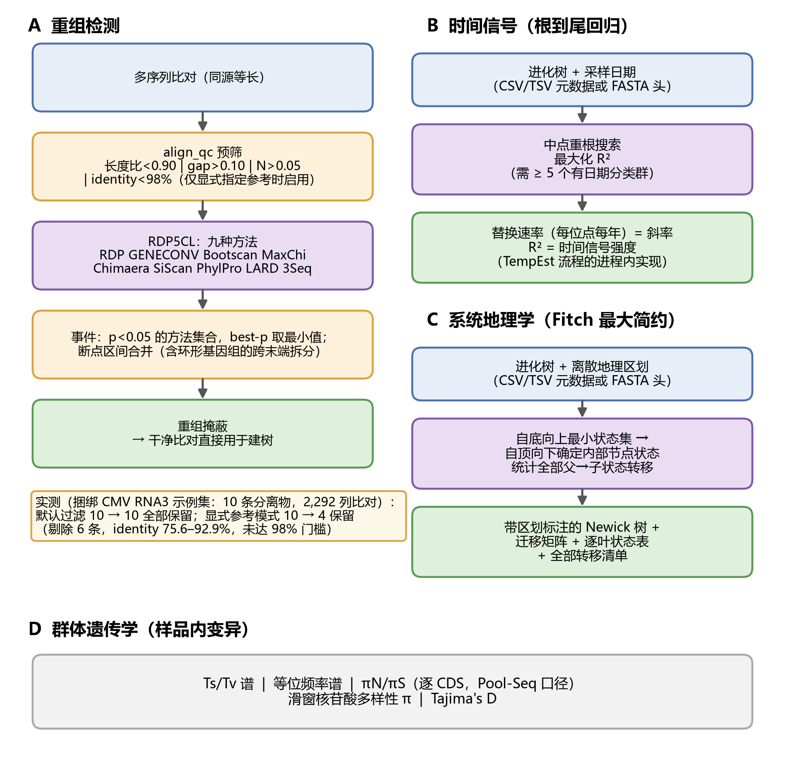
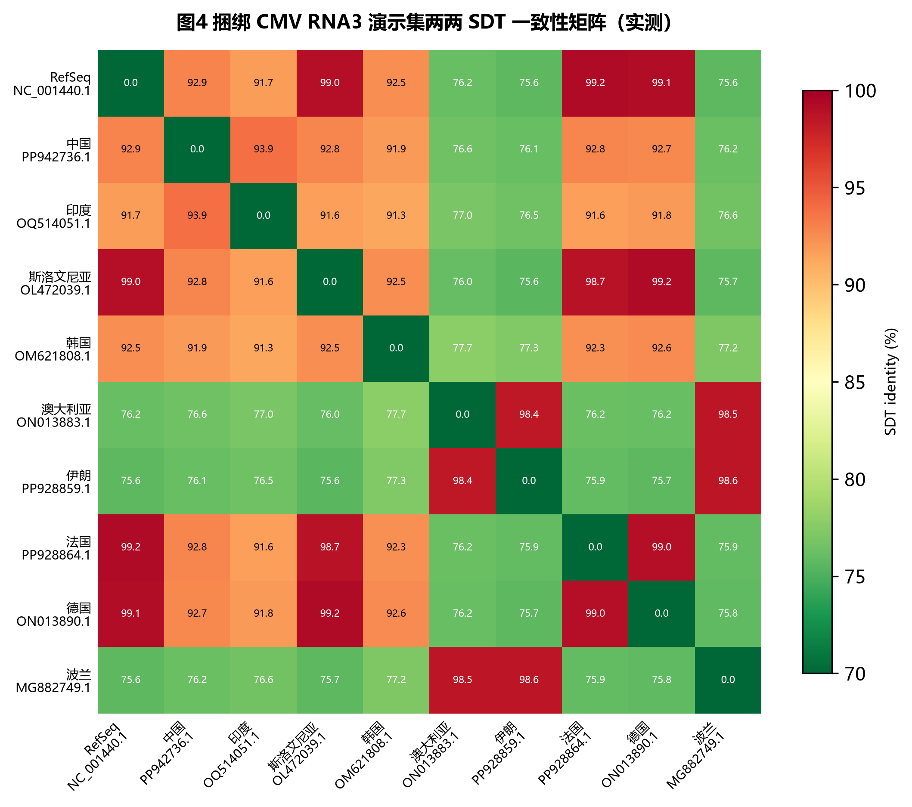

# VirusPlatform：一体化离线部署的植物病毒检测、定量与进化分析平台

**软件版本：** VirusPlatform v1.0（参考数据库构建日期 2026-09-09）

**[作者一]1，[作者二]2，[作者三]1,\***

1 [单位一]，[城市]，中国
2 [单位二]，[城市]，中国
\* 通讯作者：[email]

## 摘要

**背景** 高通量测序（high-throughput sequencing, HTS）已成为植物病毒发现与鉴定的主流手段，但"测到一条序列"与"确认一种病毒"之间，仍横亘着基因组重建、功能注释、寄主判定、进化定位、公共数据佐证等十余个分析环节。现有工具或覆盖其中一段，或依赖 Linux 服务器与云环境；对普遍使用 Windows 工作站、运行于气隙网络、缺少专职生物信息人员的植物检疫与认证实验室而言，这道专业鸿沟并未因工具增多而收窄。

**结果** 本文提出 VirusPlatform，一个分析核心完全离线运行于桌面工作站的一体化平台，以"发现与验证双轨并行、每个结论至少两条独立证据"为设计主线。发现侧，比对引擎对已知病毒灵敏检出并按期望最大化定量，组装引擎为未知病毒重建基因组；验证侧，翻译比对与保守结构域构成双证据判定，ICTV 宿主概率级联（5.9 万条寄主记录）与公共元数据交叉裁定寄主，进而接入覆盖约 2,340 万公开样本的序列溯源服务交叉印证新记录。分析链条以声明式注册的 15 个阶段（界面呈现为 13 步级联）自动衔接：质控、去寄主、识别定量、组装、验证、注释、建树、引物设计、基因组绘图与 HTML 报告一次运行完成；重组检测封装 RDP5 全部九种方法，时间信号与系统地理以简约法免依赖实现。平台提供统一元数据模式驱动的 GenBank/BioSample 提交产物链，中英双语界面暴露 212 条路由，并以一键 PyInstaller 包分发（程序约 1 GB，内置 30 个外部工具，数据库包约 3.6 GB 可选）。在 Intel Core i7-12700K 工作站上，对 8,464 条参考索引的比对在 3.7 s 建库后 0.17 s 完成；随包附带的 10 条全球黄瓜花叶病毒 RNA3 分离物演示集完整呈现了重组预筛的实测行为。

**结论** VirusPlatform 将"检出—鉴定—进化—提交"的全部环节装进一台不联网的 Windows 电脑，使病毒发现的上限取决于样品与科学问题，而非服务器与生信团队。独立诊断验证是明确的后续工作。

**关键词** 植物病毒；类病毒；高通量测序；病毒鉴定；重组分析；系统地理学；序列提交；离线部署

---

## 1 引言

植物病毒每年在全球造成可观的产量与品质损失，种苗贸易国际化、传毒介体随气候扩散进一步放大了新病毒定殖的风险 [1,2]。与此并行的是检测范式的迁移：植物病毒多潜伏无症状、混合感染是常态，靶向单病毒的 PCR 体系难以覆盖未知威胁，HTS 因此从研究手段升格为检疫、脱毒认证与种质索引的常规工具 [3,4]。国际植物病毒学界已为"测序发现的新病毒如何评估、如何命名、如何报告"建立了框架 [5]，果树等作物的 HTS 病毒检测实践也已系统化 [6]，诊断技术整体仍在快速演进 [7]。

然而，方法学的成熟并不等于分析能力的普及。从一份 FASTQ 到一条可写入报告的病毒记录，中间隔着十余个环节：读段质控、寄主读段去除、已知病毒比对定量、de novo 组装、候选序列验证、共识与变异、开放阅读框（ORF）预测与功能注释、寄主推断、系统发育定位、重组筛查、时间信号检验，直到公共数据库佐证与序列提交。这条链上的每一环都有成熟工具，却没有一个现成的整体：发现型流程如 VirusDetect [8] 局限于小 RNA 输入，VirusSeeker [9] 依托云端；容器化病毒组流程如 ViroProfiler [10] 功能完整，却以容器基础设施与命令行能力为前提；组件级工具 Kraken 2 [11]、Kaiju [12]、VirSorter2 [13]、geNomad [14] 解决分类与识别，不触及下游进化分析；桌面图形工具 BioAider [15] 服务检测后的基因组分析，不解决检测本身。链条在每个实验室的"最后一公里"断开——断点的位置，恰好是检疫与认证实验室最需要、又最缺人手去补的位置。

这类实验室的约束是刚性的。其一，硬件与系统由单位统一配发，Windows 工作站几无例外，容器与虚拟化常被安全策略禁用；其二，受管制病原的测序数据依法不得出内网，云分析无资格成为选项；其三，团队没有专职生物信息人员，脚本拼装的流程维护不下去；其四，出局的每一份报告都要经得起回溯质询，"哪个阈值、哪条证据、谁在何时运行"必须可查。相应的需求因此非常具体：一个双击安装、断网可用、把上述链条一次跑通、且每一步留痕的应用。

本文提出 VirusPlatform。平台以"发现与验证双轨并行"组织分析：比对轨对已知病毒灵敏检出并定量，组装轨为未知病毒重建基因组；每条结论至少有两条独立证据路径交叉支撑——双引擎定量互证、验证阶段双证据判定、寄主判定双源仲裁、新记录再接入公共样本溯源服务复核。其主要贡献如下：

1. **双轨发现与全链条贯通**：声明式注册的 15 个分析阶段（界面按 13 步级联）覆盖质控、去寄主、鉴定定量、组装、验证、注释、建树、引物设计、基因组绘图与报告，一次运行即完成一条候选病毒的"全套尽调"（第 2.2 节，图 1）。
2. **统计上可辩护的已知病毒鉴定**：在 8,464 条带 26 列注释的参考序列上，概率与比对双引擎并行，双轨统计过滤内置泊松期望防伪模型，多分体病毒强制节段完整性（第 2.3 节，图 2）。
3. **进化分析与溯源的完整闭环**：RDP5 九方法重组检测、免依赖根到尾回归与 Fitch 系统地理、样品内群体遗传统计，配合约 2,340 万公开样本的序列级溯源与统一元数据模式的 GenBank/BioSample 提交链（第 2.6–2.10 节，图 3）。
4. **公共数据基础设施**：NCBI SRA 与 NGDC GSA 元数据归并为统一模式，AI 辅助清洗受"本地规则优先、只减不增"仲裁约束；七页签流行病学浏览器覆盖约 21.9 万条公共序列记录（第 2.9、2.11 节）。
5. **桌面级交付工程**：仅回环监听、防路径穿越与请求伪造的服务壳，双档并发任务引擎，断点续跑与全程留痕，一键 PyInstaller 分发内置 30 个外部工具（第 2.1、2.12 节）。

---

## 2 材料与方法

### 2.1 总体架构与工程基座

VirusPlatform（v1.0）以 Python 3.12 实现，核心包 96 个文件、51,733 行代码，分为分析层（`Virus_Platform_Core`）、Web 层与无框架 JavaScript 前端（25 个模板约 12,900 行，脚本约 9,500 行，中英双语各约 1,856 条词条）。服务壳仅绑定回环地址，从 8765 起探测端口，并校验 Host/Origin/Referer 三重回环一致性以阻断跨站请求伪造与 DNS 重绑定；文件操作统一经路径守卫，外部命令一律以参数列表执行、默认 6 小时超时看门狗、支持协作式取消。界面经 pywebview/WebView2 桌面窗口或系统浏览器呈现，二者自动切换。

可靠性由任务引擎统一保障：重任务（分类、组装、注释、建树、精确一致性矩阵）与轻任务（转换、绘图、检索）分设两档并发闸门（默认 2 与 4），FIFO 排队，任务状态以 JSON 持久化，进程重启后自动恢复中断任务；前端经轮询与服务器推送事件监视进度。212 条 HTTP 路由（24 个页面级、188 个接口级）由路由清单回归测试锁定，任何端点增删都会被测试捕获。

### 2.2 全流程分析流水线

流水线是平台的主动脉：15 个阶段以声明式表注册——子采样、fastp 质控 [16]、FASTQ 转 FASTA（seqkit [17]）、kunpeng 去寄主、已知病毒鉴定（第 2.3 节）、SPAdes 组装、候选验证、共识与变异、寄主预测、ORF 预测、ORF 注释、系统发育、引物设计、基因组绘图、HTML 报告——界面按六组工作流、13 步级联呈现，用户勾选后由依赖注册表加稳定拓扑排序驱动执行，任选子集都保持合法顺序（图 1）。已完成的阶段写入哨兵文件实现断点续跑；已知病毒阶段进一步以输入指纹（读段与参考索引的路径、大小、修改时间）核验历史结果，输入未变才复用，杜绝过期结果冒充新结果。每次分析在 project.json 中留存输入、参数、完成阶段与最近 20 次运行记录，配合逐阶段耗时的指数加权滑动平均模型（大阶段按每 GB 归一），进度条与剩余时间估计随使用越来越准。源码部署的全部依赖由 `requirements.lock` 钉版。

**图 1 VirusPlatform 总体架构与 15 阶段流水线。** FASTQ 输入经六个阶段组（预处理、病毒鉴定、组装、候选验证、寄主预测与注释、下游分析与报告）由依赖感知、可断点续跑的阶段引擎执行；仅回环监听的 Flask 壳以双语界面暴露 212 条路由；双档任务引擎提供排队、流式、可恢复的执行；PyInstaller 分发按"程序（约 1 GB）/示例（约 1 MB）/数据库（约 3.6 GB 可选）"三分离布局内置 30 个外部工具。

### 2.3 已知病毒发现轨：鉴定与定量

**参考数据库。** 已知病毒轨在组装之前将读段比对到 curated 参考库：8,464 条植物病毒序列（32.5 MB），每条带 26 列注释——登录号、taxid、NCBI 与 ICTV 物种名、节段、序列类型、拓扑、分子类型、完整性、地理位置、寄主、分离来源，以及病毒元数据资源（VMR）属/科/种映射 [18,19]。构建脚本将公共记录的 299 种节段命名写法收敛为受控词表（DNA-A、RNA2、Segment 1、S/M/L 等），并对具有谱系特异命名的类群施加上下文规则（如双生病毒科 DNA-A/DNA-B），原始写法保留在平行列中。库以自包含布局分发，manifest 记录构建日期与配置；经"数据库构建"页即可重建并刷新 ICTV/VMR 字段。

**双定量引擎。** 两台引擎并行提供、结果互为校验（图 2）。概率引擎构建 salmon k=31 索引 [20]，以期望最大化估计逐参考计数，将多映射读段按概率分摊——这一性质对多分体病毒与物种复合群尤为关键——同时产出比对 BAM；比对引擎以 minibwa 产生真实比对，从索引直接读取逐参考唯一比对计数，为前者提供可审计的对照。覆盖度与深度可由 pandepth、samtools 管线 [21] 或内置 Python 实现三选一计算，三者已在测试样本上验证输出逐位一致。

**双轨统计过滤。** 候选须通过基础门槛（唯一比对读段≥10、平均深度≥0.5×），并至少满足两轨之一：A 轨为基因组级判据——覆盖度≥10%、平均深度≥0.5×、泊松比≥0.3；B 轨为紧凑 RNA 基因组的基因区救援——基因区总覆盖度≥80% 且平均覆盖度≥5%。泊松比是过滤的统计核心：设读段沿参考独立均匀分布，λ = N·Lread/Lref，期望支持度 P = 1 − e−λ，则 R = (覆盖度/100)/P；R 接近 1 表示覆盖分布与随机放置相容，R 显著小于 1 则提示读段集中于参考的局部——低水平假信号的典型形态。该模型的均匀性假设偏保守，0.3 截断应理解为筛选启发式而非标定的检验统计量，阈值开放用户调整，其对真实覆盖波动的敏感性留待验证工作量化。多分体病毒另须通过节段完整性检验：参考库中该物种的全部节段同时检出方予确认，节段不全者降级为可见的中间状态而非静默丢弃。通过过滤的参考按读段级平均核苷酸一致性（ANI = (aln_len − NM)/aln_len，每参考最多抽样 10,000 条比对）分流：ANI≥95% 判"确诊"，<95% 标"疑似新种"，缺失报"未测定"。鉴于 ICTV 种级界定阈值因科而异，95% 在文档中定位为株系新颖性的实用筛选线。

**下游产物。** 确诊参考进入共识链（minibwa 单参考重比对 + viral_consensus，质量≥20、深度≥5、频率≥0.5）与变异检测（bcftools [22]，QUAL≥3.5、最低频率 0.05），变异经 SnpEff [23] 逐参考注释，无编码区的类病毒自动跳过注释。全部判定输出为机器可读表：全量汇总、最佳命中、疑似新种、带逐读段原因的剔除清单；批处理模式逐样本写检查点，失败样本显式记录为"失败 ≠ 阴性"。从鉴定 BAM 提取的病毒读段可直接作为组装轨输入，使组装聚焦病毒信号。

**图 2 已知病毒鉴定与定量套件。** 读段经概率引擎（salmon EM，多映射分摊）或比对引擎（minibwa 真实比对计数）定量，三个覆盖度后端输出逐位一致；候选通过基础门槛与双轨统计过滤（A 轨含泊松防伪模型，公式见右侧面板），多分体病毒强制节段完整性，最终按 ANI 分流为确诊或疑似新种；全部判定输出带原因的机器可读表，并接续共识、变异与靶向组装。

### 2.4 未知病毒发现轨：组装与双证据验证

比对轨只能看见库里已有的病毒；未知病毒的发现依赖组装轨。去寄主读段（或比对轨提取的病毒读段）经 SPAdes [24] 组装（默认 metaviral 模式，内存、最小 contig 长度、输入来源可配），contig 由 kunpeng 分类并按置信度过滤。分类为"病毒"并不等于"是病毒"：候选验证阶段施加两路独立证据——DIAMOND blastx [25] 对照内置 RefSeq [26] 病毒蛋白库的翻译比对，与 MMseqs2 [27] 对照 CDD [28] 结构域模型的保守域确认——按并集规则合成四级判定：known（有明确参考匹配）、novel（病毒蛋白同源但无参考命中）、domain_only（仅检出病毒结构域）、unclassified，另设类病毒核酸搜索路径 [29]。unclassified 全量保留为新病毒候选池。一套候选病毒的"出生证明"由此齐备：序列（组装）、功能（验证与注释）、寄主（第 2.5 节）、亲缘（第 2.6 节）、公共样本佐证（第 2.9 节）。

### 2.5 功能注释与寄主判定

ORF 以 pyrodigal [30] 与 RNA 病毒感知的 pyrodigal-rv [31] 预测（默认最短 100 aa），功能注释按三层递进：DIAMOND、MMseqs2 或 blastp 对照 RefSeq 病毒蛋白库（首次使用自动下载，约 107 MB），HMM（pyhmmer/CDD）为远缘 ORF 兜底；输出逐 ORF 表、功能类别与科级分布及 GFF3 轨道，基因组诊断模块另报内部终止密码子、移码与完整性缺陷。

寄主判定采用"级联查表 + 双源仲裁"。平台内置 5.9 万条目的寄主概率表（源自 ICTV 分类与寄主记录的交叉统计），按物种→属→科→目四级级联查表，取层级最深、置信度最高者；同时核对该参考在 NCBI 元数据中的一手寄主记录。两源一致判高置信，冲突时以一手元数据优先，仅其一者取其一，全无记 Unknown。结果以桑基图（病毒科→寄主类别）与旭日图（科→属→种）呈现。

### 2.6 系统发育与比较基因组学

系统发育阶段按 BLAST 最好命中物种分组，逐组以 MAFFT [32] 比对（默认 auto，可选 L-INS-i；中日韩路径经 ASCII 中转目录处理）、trimAl [33] 清剪（失败自动回退），再以三种引擎之一建树：免依赖的纯 Python 邻接法、FastTree 2 [34]（GTR+Γ）、或 IQ-TREE 3 [35,36]（ModelFinder [37] 模型选择，超快自展与 SH-aLRT 各 1,000 次双支持值 [38,39]）。两道护栏使该阶段在桌面硬件上稳健：参考长度上限 25,000 bp 抑制 MAFFT 的平方级内存行为，逐物种建树避免跨物种的无信息比对。公共 NCBI 参考可自动并入比对，并支持按大区、属、谱系的层级参考抽样。比较基因组工具以精确 SDT v1.3 公式 [40] 复刻全长成对 identity（逐对比对、gap 删除口径、与原工具对拍验证），另提供 NT/AA 一致性矩阵、复合热图与交互查看器。引物设计封装 primer3 [41,42]，支持全长分窗与保守区两种模式，带候选打分与热力学检查。

### 2.7 重组检测

重组分析以单一工作流封装 Windows 原生捆绑的 RDP5 命令行程序 [43]，一次调用覆盖 RDP、GENECONV、Bootscan、MaxChi、Chimaera、SiScan、PhylPro、LARD、3Seq 九种方法 [44,43]。RDP5 要求同源等长输入，前置的比对质控按四条判据剔除不合格序列：去 gap 长度比<0.90（不完整片段）、gap 比例>0.10（比对质量差）、模糊碱基比例>0.05（低质量），以及仅在显式指定参考时启用的成对 identity<98%（群体外离群；SDT 公式 [40]）。identity 判据之所以与参考绑定，是因为 98% 的线只对近等序列有意义：在随包的 10 条全球 CMV RNA3 分离物比对上，以 RefSeq 为参考启用该判据将剔除 6/10 条有效分离物（identity 75.6%–92.9%），而仅长度/gap/模糊碱基判据则全部保留——误杀跨亚组样本是这条线的固有风险，绑定参考是平台给出的解法（第 3.2 节）。

RDP5 的事件表被完整解析：断点坐标、重组体/小亲本/大亲本指派与逐方法 p 值；事件级显著性集合定义为 p<0.05 的方法集合，最佳 p 值取最小。遵循 RDP5 自身的建议 [43]，全部事件区间（含环形基因组的跨末端拆分）合并后掩蔽为 N，导出无重组"干净比对"直接供建树，把"先除重组信号、再建树"的原则落成默认动作。平台曾自研三序列法原型，在合成嵌合体（6 条 1 kb 序列、真实断点 500）上得到 18 检出对 1 真事件，遂整体删除；RDP5 是唯一重组引擎，该阴性结果作为方法论教训写入本文。

### 2.8 时间信号、系统地理与群体遗传

三个免依赖工具回答进化层面最常被问到的三个问题（图 3）。进化多快：根到尾回归在进程内复现 TempEst [45] 工作流，将带采样日期的序列（CSV/TSV 或 `accession|location|year` 格式 FASTA 头）置于无根图上，遍历中点重根位置取 R² 最大者，斜率即每位点每年替换数，R² 度量时间结构强度；要求至少 5 个有日期分类群。从哪里来：Fitch 最大简约 [46] 为树重构离散地理状态，自底向上求内部节点最小状态集、自顶向下定值，统计全部父→子转移得迁移矩阵，输出区划标注树、迁移矩阵、逐叶状态表与转移清单；需要时间校准的用户可接 TreeTime [47]。多样性如何结构化：从逐样本变异目录计算转换/颠换谱、等位频率谱、逐编码区 πN/πS（Pool-Seq 口径）、滑窗核苷酸多样性与 Tajima's D，支持寄主内病毒群体的选择压力筛查。

**图 3 进化动力学模块。** (A) 重组工作流：比对质控预筛、RDP5 九方法检测、事件解析与断点合并、重组掩蔽输出干净比对；内插框为捆绑 CMV RNA3 演示集的实测行为。(B) 根到尾回归估计替换速率与时间信号。(C) Fitch 最大简约系统地理重构，产出区划标注树与迁移矩阵。(D) 样品内群体遗传统计。

### 2.9 公共数据溯源：元数据统一化与样本级回溯

病毒序列的意义取决于元数据，而公共库的元数据以异构著称。平台将 NCBI 序列读取档案（SRA）[48,49] 的 18 个提取维度（运行号、发布/采集日期、位置、来源、组织、寄主龄期、文库类型、BioProject、PMID 等）与国家基因组科学数据中心 GSA [50] 的 10 个维度归并为统一 14 列模式；基因组仓库（GWH）[51] 与 Europe PMC [52] 提供 BioProject 级与文献溯源，位置字符串统一为"国家, 省, 市"三级格式。元数据清洗可交由大模型辅助（预配置 DeepSeek 与 Kimi 端点），但受三重仲裁约束：本地规则提取的字段永远优先，模型只许填补空缺与重排格式，净化层只允许做减法、归位与格式化——绝不允许捏造；所有经 AI 处理的字段带溯源后缀。该模块是平台唯一的联网组件，且需用户显式配置 API Key 方才生效，本地测序数据永不外发。

溯源的另一维度是"这条序列此前被测到过吗"。平台接入 LOGAN 公共溯源服务（logan-search.org，IndexThePlanet 计划对 NCBI SRA 全量组装构建的 k-mer 索引，覆盖约 2,340 万公开样本），将本平台鉴定的病毒 contig 或任意片段提交查询，回答"这条序列在哪些物种和样本中真实存在"，并以官方结果表聚合出报告。工作流分两手：手动半自动（平台切片、用户在网站提交、结果表导入聚合），或经 Selenium 驱动本机浏览器的批量自动（支持邮箱池轮换、断点续跑与补漏轮）；批量自动之外，平台自身不向外部发起任何请求，数据边界与第 2.1 节的离线承诺一致。对一份新病毒记录而言，这一步补上的是"公共样本交叉印证"——它的近缘序列此前是否、以及在哪些样本中出现过，直接关系到新记录的置信与流行病学解读。

### 2.10 序列提交准备：GenBank 与 BioSample

发现的最后一公里是提交。平台提供"一张表驱动两类产物"的提交准备链：用户在统一元数据表（unified_metadata）中填写隔离寄主、采集地、日期等属性，平台据此生成 GenBank 与 BioSample 的提交产物，并调用捆绑的 table2asn 完成 ASN.1 转换，附带提交前检查报告。结合第 2.3–2.5 节的共识序列、注释轨道与寄主判定，一条新病毒从读段到可提交记录的全部材料在同一平台内闭环生成，无需在多个工具间手工搬运数据。

### 2.11 七页签流行病学浏览器

服务端渲染的病毒浏览器在约 21.9 万条公共植物病毒序列记录上提供七个协同视图：时空演变趋势、全基因组变异、可筛选记录表（5,000 行截断显式提示）、引物数据库、寄主范围、介体传播与逐病毒档案。模块由 13 个回调的 Dash 应用重构为 13 个原生 Flask 接口，行为保留而运行时依赖从打包产物中移除，为检疫用户提供"本地发现—公共背景"的就地对照。

### 2.12 分发形态与质量保障

平台以 PyInstaller onedir 包分发，内嵌 Python 运行时、前端资源（含离线 Plotly 与树/热图查看器）与 30 个预编译外部工具（版本钉选见表 3），按"程序（约 1 GB）/示例（约 1 MB）/数据库（约 3.6 GB 可选）"三分离布局交付；构建后自检逐一验证包内工具可执行，传递依赖的激进裁剪使首版产物从 2.05 GB 降至约 1 GB。质量保障依托 85 个自动化脚本：30 个端到端集成测试、20 个静态/动态检查、4 个单元测试，加审计、探针与路由基线守卫；18 个示例输入与 26 个 curated 示例结果集既作文档亦作回归夹具。维护策略同样明确：工具清单钉版、数据库 manifest 记录构建日期、上游工具发布修复即重建。

---

## 3 结果

### 3.1 平台清单

表 1 给出 15 阶段流水线的阶段—工具—产物映射，表 2 汇总 25 个独立工具（含鉴定—分类与定量—共识两条一键复合链），表 3 列出关键捆绑工具的钉选版本。

**表 1. 15 阶段分析流水线。**

| 阶段 | 功能 | 关键工具 | 代表产物 |
|---|---|---|---|
| subsample | 确定性读段子采样 | — | sub_R1/R2.fastq.gz |
| fastp | 读段质控与过滤 | fastp [16] | clean reads、QC 报告 |
| fq2fa | FASTQ→FASTA | seqkit [17] | conv_R1/R2.fa.gz |
| host | 寄主读段去除 | kunpeng | 保留读段、寄主占比 |
| kvsuite | 已知病毒鉴定与定量 | salmon [20] / minibwa | 鉴定表、BAM、病毒读段 |
| assembly | 宏基因组组装与 contig 分类 | SPAdes [24]、kunpeng、BLAST [29] | contigs、分类 TSV |
| verify | 候选验证（双证据） | DIAMOND [25]、MMseqs2 [27]、CDD [28] | calls.tsv |
| consensus | 共识与变异 | minimap2 [53]、viral_consensus、bcftools [22] | consensus.fa、variants.tsv |
| hostana | 寄主预测 | ICTV 级联 [18] | host_prediction.tsv、桑基/旭日图 |
| orf | ORF 预测 | pyrodigal(-rv) [30] | faa/ffn/gff |
| orfa | ORF 功能注释 | DIAMOND/MMseqs2/blastp + HMM | orf_annotation.tsv、GFF3 |
| phylo | 比对、建树、identity 矩阵 | MAFFT [32]、trimAl [33]、FastTree [34] / IQ-TREE [35] | tree.nwk、SDT 矩阵 |
| primer | 引物设计 | primer3 [41,42] | primers.tsv |
| gbdraw | 基因组图 | gbdraw / DNA Features Viewer | SVG 圈图/线图 |
| report | HTML 报告 | Plotly、pycirclize | report.html |

**表 2. 25 个独立分析工具（按类别）。**

| 类别 | 工具 |
|---|---|
| 读段处理 | convert、fastp、hostremoval |
| 鉴定与分类 | identify、assemble、contigs、verify、kvsuite；复合链 kvchain |
| 基因组分析 | consensus、orf、orfa、genoplot、primer、dsrna |
| 比较基因组学 | structcmp、sdt（精确 SDT）、identity、align、quicktree |
| 进化动力学 | rdp（RDP5 九方法）、rtt（时间信号）、phylogeo（Fitch） |
| 复合链 | virchain（鉴定—分类链）、kvchain（定量—共识链） |

**表 3. 关键捆绑工具钉选版本（完整清单随包分发）。**

| 工具 | 版本 | 工具 | 版本 |
|---|---|---|---|
| kunpeng | 0.7.12 | samtools/bcftools | 1.24（bcftools） |
| IQ-TREE | 3.0.1 | biopython | 1.88 |
| pyrodigal | 3.7.1 | Flask | 3.1.3 |
| pyrodigal-rv | 0.1.0 | polars | 1.44.2 |
| pyhmmer | 0.12.3 | plotly | 7.0.0 |
| primer3-py | 2.2.0 | pywebview | 6.2.1 |

### 3.2 实测基准与实操演示

本文报告的数字均可在随包示例上复现（Intel Core i7-12700K，20 逻辑核，64 GB 内存，Windows 11，Python 3.12.10；除注明外 8 线程；脚本随稿提供）。比对基准：对全部 8,464 条参考索引（32.5 MB），minibwa 建索引 3.73 s，比对捆绑双端示例集（3,600 对；7,200/7,200 条记录恢复比对）0.17 s，约合每秒 20,600 读段对。作为内部开发基准，一个混合病毒模拟样品完成全部五模块已知病毒工作流（鉴定、过滤、共识、绘图、变异）用时 7.9 s——两者都是吞吐量口径的工程数字，不是诊断性能。

重组预筛的实测行为以随包的 CMV RNA3 演示集呈现：10 条全球分离物（中国、印度、斯洛文尼亚、韩国、澳大利亚、伊朗、法国、德国、波兰及 RefSeq 参考 NC_001440.1；2,292 个比对列）。默认过滤（长度/gap/模糊碱基）全部保留 10 条；显式参考模式（参考 NC_001440.1，98% identity 门槛）保留 4 条、剔除 6 条（identity 75.6%–92.9%）。由同一比对以平台公式计算的全对 SDT identity 矩阵介于 75.6%–99.2%，对 RefSeq 参考均值 89.1%（图 4）：亚组内 98%–99%（RefSeq—法国—德国—斯洛文尼亚；澳大利亚—伊朗—波兰），亚组间约 75%–77%，中国、印度、韩国分离物居 91%–93% 的中间档——与 CMV 已知亚组结构一致，也直观解释了 identity 判据为何必须绑定显式参考。度量一致性方面，三个覆盖度后端输出逐位一致，路由守卫确认 212 端点面，构建后自检验证包内 30 个工具全部可执行。

本文的评估定位为实现级：灵敏度、特异度与检出限对诊断金标准的测定，以及在公共植物病毒 HTS panel 上与替代流程的平行比较，属于计划中的独立验证工作，本文不作声称。

**图 4 捆绑 CMV RNA3 演示集的两两 SDT 一致性矩阵（实测）。** 以平台同口径公式由随包比对（10 条全球分离物，2,292 列）计算。块状结构（75.6%–99.2%；对 RefSeq 均值 89.1%）与 CMV 亚组分化一致：亚组内 98%–99%，亚组间 75%–77%，中国/印度/韩国分离物对 RefSeq 居 91%–93% 中间档。该图同时说明 identity 判据绑定显式参考的必要性：以 RefSeq 为参考时，六个跨亚组分离物将被 98% 门槛剔除。

---

## 4 讨论

**证据链完备性是平台的设计主线。** 植物病毒报告的效力取决于证据的层数。VirusPlatform 为每条结论配置了至少两条独立路径：已知病毒的定量由概率与比对双引擎互证，未知的判定由翻译比对与结构域双证据合成，寄主推断由 ICTV 级联与 NCBI 一手记录双源仲裁，新记录再经约 2,340 万公开样本的序列级溯源复核其在公共数据中的踪迹。比对轨与组装轨并行则保证了发现空间的完整：库里有的病毒不被组装噪声淹没，库里没有的病毒不因无参考而漏检。这四组互证不是功能堆叠，而是对"单证据结论不可辩护"这一检疫现实的直接回应。

**定位：补链，而非重复造轮。** 组件层面，平台与 k-mer 分类器 [11,12] 及 contig 级病毒识别器 [13,14] 互补——速度主导处（去寄主、contig 初筛）用 k-mer，统计可辩护性主导处（检测、定量）用参考比对；平台早期仅以 k-mer 筛查的版本正是因无法区分低水平假信号与真实感染而转向比对定量。流程层面，相对 VirusDetect [8] 与 VirusSeeker [9]，平台把覆盖面从检测延至进化与提交；相对 ViroProfiler [10] 等容器化流程，平台以放弃多租户扩展换取零基础设施可操作——受限政务工作站普遍禁用容器运行时，原生 Windows 包是这一用户群阻力最小的交付形态；相对 BioAider [15] 等桌面工具，平台补齐了检测、定量与作业管理的数据底座。双引擎定量加泊松防伪的组合，据我们所知尚未在现有植物病毒平台中出现。

**三项权衡的说明。** 其一，重组检测封装 RDP5 九方法而非自研：自研三序列法原型在合成嵌合体上 18 检出对 1 真事件的阴性结果说明，已发表启发式的非正式复刻极难达标，封装经过验证的实现是更诚实的工程决策。其二，进化分析取简约法与回归而舍贝叶斯框架：根到尾回归与 Fitch 重构在桌面硬件上数秒内给出速率与传播方向，而贝叶斯系统地理的运行时长与配置门槛与目标用户不相容；需要时间校准者可接 TreeTime。其三，平台按"一台工作站、一位分析师、本地数据"交付：仅回环监听、无鉴权，这一边界在文档中显式声明，以杜绝误部署为共享服务；唯一的联网模块（公共元数据检索与可选 AI 清洗）需显式开启且不触碰本地测序数据。

**局限。** 本文的评估是实现级的，诊断性能（灵敏度、特异度、检出限）的独立测定尚未完成，这是诊断使用前必须补上的一课。平台面向短读段数据，原生长读段流程与超越 SNV 口径的准种重构尚未集成。参考比对式鉴定受数据库覆盖约束：8,464 条 curated 参考可缓解但无法消除对未研究谱系的发现偏倚；泊松比、双轨截断与 95% ANI 线均为筛选启发式，跨病毒科的标定有待验证数据。AI 辅助的元数据清洗虽受仲裁与净化层约束，原则上仍可能传播上游错误，故所有 AI 触碰字段保留溯源标记供人工复核。

**展望。** 近期工作按优先级排列：独立诊断验证（含与替代流程的平行比较）、经验证的 ONT 流程、时间校准系统发育的接入、多用户服务器模式、参考库对 ICTV 版本的月度自动对账，以及面向检疫与认证实验室的结构化可用性评估。

---

## 5 结论

VirusPlatform 把从检出到发表的全部环节——质控、去寄主、双轨发现、双证据验证、注释与寄主判定、进化与重组分析、公共样本溯源、GenBank/BioSample 提交——装进一台不联网的 Windows 电脑，以双引擎、双证据、双源仲裁的证据链组织每个结论，并以一键分发把它交到没有生信团队的实验室手里。分析链条的完备程度，决定一个团队能做出多少病毒发现；当这条链在一台桌面机上完整闭合，发现的上限便取决于样品与科学问题，而不是服务器与生信团队。独立诊断验证是把这一实现推向诊断应用的既定关口。

---

## 数据与代码可用性

- **项目名称：** VirusPlatform（v1.0；参考数据库 2026-09-09 构建）。
- **操作系统：** Windows 10/11 x64；源码部署需 Python 3.12（依赖钉版于 `requirements.lock`）。
- **编程语言：** Python 3.12；无框架 JavaScript 前端；30 个预编译第三方工具。
- **源码可用性：** 录用后存入公开仓库（GitHub）并在 Zenodo 归档获取 DOI；数据库构建 manifest 随包分发。
- **示例数据：** 随包附 18 个示例输入与 26 个 curated 示例结果集；CMV RNA3 演示集使用公共序列（NC_001440.1 及 PP942736.1、OQ514051.1、OL472039.1、OM621808.1、ON013883.1、PP928859.1、PP928864.1、ON013890.1、MG882749.1）。
- **非学术使用限制：** 无计划限制；最终许可随代码存入声明。

## 缩略语

HTS：高通量测序；ANI：平均核苷酸一致性；ORF：开放阅读框；SDT：Sequence Demarcation Tool；SRA：序列读取档案；GSA：基因组序列归档；VMR：病毒元数据资源；ICTV：国际病毒分类委员会；SNV：单核苷酸变异；EM：期望最大化。

## 致谢

[待补充。]

## 作者贡献

[待补充。]

## 利益冲突

作者声明不存在可能构成潜在利益冲突的商业或财务关系。

## 参考文献

1. Anderson PK, Cunningham AA, Patel NG, Morales FJ, Epstein PR, Daszak P. Emerging infectious diseases of plants: pathogen pollution, climate change and agrotechnology drivers. Trends Ecol Evol. 2004;19(10):535-544. doi:10.1016/j.tree.2004.07.021
2. Jones RAC, Naidu RA. Global dimensions of plant virus diseases: current status and future perspectives. Annu Rev Virol. 2019;6(1):387-409. doi:10.1146/annurev-virology-092818-015606
3. Hadidi A, Flores R, Candresse T, Barba M. Next-generation sequencing and genome editing in plant virology. Front Microbiol. 2016;7:1325. doi:10.3389/fmicb.2016.01325
4. Villamor DEV, Ho T, Al Rwahnih M, Martin RR, Tzanetakis IE. High throughput sequencing for plant virus detection and discovery. Phytopathology. 2019;109(5):716-725. doi:10.1094/PHYTO-07-18-0257-RVW
5. Massart S, Candresse T, Gil J, Lacomme C, Predajna L, Ravnikar M, et al. A framework for the evaluation of biosecurity, commercial, regulatory, and scientific impacts of plant viruses and viroids identified by NGS technologies. Front Microbiol. 2017;8:45. doi:10.3389/fmicb.2017.00045
6. Maliogka VI, Minafra A, Saldarelli P, Ruiz-Garcia AB, Glasa M, Katis N, Olmos A. Recent advances on detection and characterization of fruit tree viruses using high-throughput sequencing technologies. Viruses. 2018;10(8):436. doi:10.3390/v10080436
7. Kanapiya A, Amanbayeva U, Tulegenova Z, et al. Recent advances and challenges in plant viral diagnostics. Front Plant Sci. 2024;15:1451790. doi:10.3389/fpls.2024.1451790
8. Zheng Y, Gao S, Padmanabhan C, et al. VirusDetect: an automated pipeline for efficient virus discovery using deep sequencing of small RNAs. Virology. 2017;500:130-138. doi:10.1016/j.virol.2016.10.017
9. Zhao G, Wu G, Lim ES, Droit L, Krishnamurthy S, Barouch DH, Virgin HW, Wang D. VirusSeeker, a computational pipeline for virus discovery and virome composition analysis. Virology. 2017;503:21-30. doi:10.1016/j.virol.2017.01.005
10. Ru J, Khan Mirzaei M, Xue J, Peng X, Deng L. ViroProfiler: a containerized bioinformatics pipeline for viral metagenomic data analysis. Gut Microbes. 2023;15(1):2192522. doi:10.1080/19490976.2023.2192522
11. Wood DE, Lu J, Langmead B. Improved metagenomic analysis with Kraken 2. Genome Biol. 2019;20(1):257. doi:10.1186/s13059-019-1891-0
12. Menzel P, Ng KL, Krogh A. Fast and sensitive taxonomic classification for metagenomics with Kaiju. Nat Commun. 2016;7:11257. doi:10.1038/ncomms11257
13. Guo J, Bolduc B, Zayed AA, et al. VirSorter2: a multi-classifier, expert-guided approach to detect diverse DNA and RNA viruses in metagenomic samples. Microbiome. 2021;9(1):37. doi:10.1186/s40168-020-00990-y
14. Camargo AP, Roux S, Schulz F, et al. Identification of mobile genetic elements with geNomad. Nat Biotechnol. 2024;42(8):1303-1312. doi:10.1038/s41587-023-01953-y
15. Zhou ZJ, Qiu Y, Pu Y, Huang X, Ge XY. BioAider: an efficient tool for viral genome analysis and its application in tracing SARS-CoV-2 transmission. Sustain Cities Soc. 2020;63:102466. doi:10.1016/j.scs.2020.102466
16. Chen S, Zhou Y, Chen Y, Gu J. fastp: an ultra-fast all-in-one FASTQ preprocessor. Bioinformatics. 2018;34(17):i884-i890. doi:10.1093/bioinformatics/bty560
17. Shen W, Le S, Li Y, Hu F. SeqKit: a cross-platform and ultrafast toolkit for FASTA/Q file processing. PLoS One. 2016;11(10):e0163962. doi:10.1371/journal.pone.0163962
18. Lefkowitz EJ, Dempsey DM, Hendrickson RC, Orton RJ, Siddell SG, Smith DB. Virus taxonomy: the database of the International Committee on Taxonomy of Viruses (ICTV). Nucleic Acids Res. 2018;46(D1):D708-D717. doi:10.1093/nar/gkx932
19. Hatcher EL, Zhdanov SA, Bao Y, et al. Virus Variation Resource - improved response to emergent viral outbreaks. Nucleic Acids Res. 2017;45(D1):D482-D490. doi:10.1093/nar/gkw1065
20. Patro R, Duggal G, Love MI, Irizarry RA, Kingsford C. Salmon provides fast and bias-aware quantification of transcript expression. Nat Methods. 2017;14(4):417-419. doi:10.1038/nmeth.4197
21. Li H, Handsaker B, Wysoker A, et al. The Sequence Alignment/Map format and SAMtools. Bioinformatics. 2009;25(16):2078-2079. doi:10.1093/bioinformatics/btp352
22. Danecek P, Bonfield JK, Liddle J, et al. Twelve years of SAMtools and BCFtools. Gigascience. 2021;10(2):giab008. doi:10.1093/gigascience/giab008
23. Cingolani P, Platts A, Wang LL, et al. A program for annotating and predicting the effects of single nucleotide polymorphisms, SnpEff: SNPs in the genome of Drosophila melanogaster strain w1118; iso-2; iso-3. Fly (Austin). 2012;6(2):80-92. doi:10.4161/fly.19695
24. Bankevich A, Nurk S, Antipov D, et al. SPAdes: a new genome assembly algorithm and its applications to single-cell sequencing. J Comput Biol. 2012;19(5):455-477. doi:10.1089/cmb.2012.0021
25. Buchfink B, Xie C, Huson DH. Fast and sensitive protein alignment using DIAMOND. Nat Methods. 2015;12(1):59-60. doi:10.1038/nmeth.3176
26. O'Leary NA, Wright MW, Brister JR, et al. Reference sequence (RefSeq) database at NCBI: current status, taxonomic expansion, and functional annotation. Nucleic Acids Res. 2016;44(D1):D733-D745. doi:10.1093/nar/gkv1189
27. Steinegger M, Soding J. MMseqs2 enables sensitive protein sequence searching for the analysis of massive data sets. Nat Biotechnol. 2017;35(11):1026-1028. doi:10.1038/nbt.3988
28. Lu S, Wang J, Chitsaz F, et al. CDD/SPARCLE: the conserved domain database in 2020. Nucleic Acids Res. 2020;48(D1):D265-D268. doi:10.1093/nar/gkz991
29. Camacho C, Coulouris G, Avagyan V, et al. BLAST+: architecture and applications. BMC Bioinformatics. 2009;10:421. doi:10.1186/1471-2105-10-421
30. Larralde M. Pyrodigal: Python bindings and interface to Prodigal, an efficient method for gene prediction in prokaryotes. J Open Source Softw. 2022;7(72):4296. doi:10.21105/joss.04296
31. De Coninck L. pyrodigal-rv: RNA-virus-aware gene prediction based on Pyrodigal [Computer software, v0.1.0]. GitHub. https://github.com/LanderDC/pyrodigal-rv
32. Katoh K, Standley DM. MAFFT multiple sequence alignment software version 7: improvements in performance and usability. Mol Biol Evol. 2013;30(4):772-780. doi:10.1093/molbev/mst010
33. Capella-Gutierrez S, Silla-Martinez JM, Gabaldon T. trimAl: a tool for automated alignment trimming in large-scale phylogenetic analyses. Bioinformatics. 2009;25(15):1972-1973. doi:10.1093/bioinformatics/btp348
34. Price MN, Dehal PS, Arkin AP. FastTree 2 - approximately maximum-likelihood trees for large alignments. PLoS One. 2010;5(3):e9490. doi:10.1371/journal.pone.0009490
35. Nguyen LT, Schmidt HA, von Haeseler A, Minh BQ. IQ-TREE: a fast and effective stochastic algorithm for estimating maximum-likelihood phylogenies. Mol Biol Evol. 2015;32(1):268-274. doi:10.1093/molbev/msu300
36. Minh BQ, Schmidt HA, Chernomor O, et al. IQ-TREE 2: new models and efficient methods for phylogenetic inference in the genomic era. Mol Biol Evol. 2020;37(5):1530-1534. doi:10.1093/molbev/msaa015
37. Kalyaanamoorthy S, Minh BQ, Wong TKF, von Haeseler A, Jermiin LS. ModelFinder: fast model selection for accurate phylogenetic estimates. Nat Methods. 2017;14(6):587-589. doi:10.1038/nmeth.4285
38. Hoang DT, Chernomor O, von Haeseler A, Minh BQ, Vinh LS. UFBoot2: improving the ultrafast bootstrap approximation. Mol Biol Evol. 2018;35(2):518-522. doi:10.1093/molbev/msx281
39. Guindon S, Dufayard JF, Lefort V, Anisimova M, Hordijk W, Gascuel O. New algorithms and methods to estimate maximum-likelihood phylogenies: assessing the performance of PhyML 3.0. Syst Biol. 2010;59(3):307-321. doi:10.1093/sysbio/syq010
40. Muhire BM, Varsani A, Martin DP. SDT: a virus classification tool based on pairwise sequence alignment and identity calculation. PLoS One. 2014;9(9):e108277. doi:10.1371/journal.pone.0108277
41. Koressaar T, Remm M. Enhancements and modifications of primer design program Primer3. Bioinformatics. 2007;23(10):1289-1291. doi:10.1093/bioinformatics/btm091
42. Untergasser A, Cutcutache I, Koressaar T, Ye J, Faircloth BC, Remm M, Rozen SG. Primer3 - new capabilities and interfaces. Nucleic Acids Res. 2012;40(15):e115. doi:10.1093/nar/gks596
43. Martin DP, Varsani A, Roumagnac P, Botha G, Maslamoney S, Schwab T, Kelz Z, Kumar V, Murrell B. RDP5: a computer program for analyzing recombination in, and removing signals of recombination from, nucleotide sequence datasets. Virus Evol. 2021;7(1):veaa087. doi:10.1093/ve/veaa087
44. Martin DP, Murrell B, Golden M, Khoosal A, Muhire B. RDP4: detection and analysis of recombination patterns in virus genomes. Virus Evol. 2015;1(1):vev003. doi:10.1093/ve/vev003
45. Rambaut A, Lam TT, Carvalho LM, Pybus OG. Exploring the temporal structure of heterochronous sequences using TempEst (formerly Path-O-Gen). Virus Evol. 2016;2(1):vew007. doi:10.1093/ve/vew007
46. Fitch WM. Toward defining the course of evolution: minimum change for a specific tree topology. Syst Zool. 1971;20(4):406-416. doi:10.2307/2412116
47. Sagulenko P, Puller V, Neher RA. TreeTime: maximum-likelihood phylodynamic analysis. Virus Evol. 2018;4(1):vex042. doi:10.1093/ve/vex042
48. Leinonen R, Sugawara H, Shumway M; International Nucleotide Sequence Database Collaboration. The Sequence Read Archive. Nucleic Acids Res. 2011;39(Database issue):D19-D21. doi:10.1093/nar/gkq1019
49. Katz K, Shutov O, Lapoint R, Kimelman M, Brister JR, O'Sullivan C. The Sequence Read Archive: a decade more of explosive growth. Nucleic Acids Res. 2022;50(D1):D387-D390. doi:10.1093/nar/gkab1053
50. CNCB-NGDC Members and Partners. Database resources of the National Genomics Data Center, China National Center for Bioinformation in 2026. Nucleic Acids Res. 2026;54(D1):D28-D47. doi:10.1093/nar/gkaf1172
51. Chen M, Ma Y, Wu S, et al. Genome Warehouse: a public repository housing genome-scale data. Genomics Proteomics Bioinformatics. 2021;19(4):584-589. doi:10.1016/j.gpb.2021.04.001
52. Europe PMC Consortium. Europe PMC: a full-text literature database for the life sciences and platform for innovation. Nucleic Acids Res. 2015;43(D1):D1042-D1048. doi:10.1093/nar/gku1061
53. Li H. Minimap2: pairwise alignment for nucleotide sequences. Bioinformatics. 2018;34(18):3094-3100. doi:10.1093/bioinformatics/bty191
