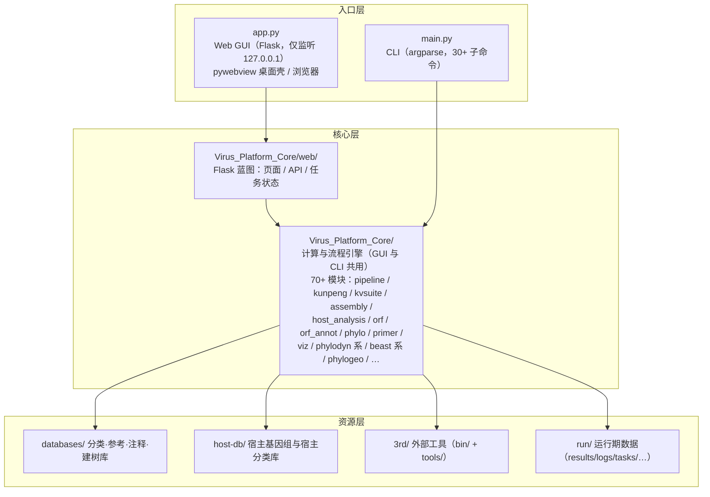

# Architecture · 平台架构与目录结构

> 返回 [Home](Home) ｜ 上一页：[Quick-Start](Quick-Start) ｜ 下一页：[Pipeline-Overview](Pipeline-Overview)

---

## 分层架构



- **GUI 与 CLI 共用同一引擎**：`app.py` 只做页面与任务调度，所有计算都在 `Virus_Platform_Core`；`main.py` 直接调引擎函数，因此两者结果、断点、参数语义完全一致。
- **打包版引擎入口**：`engine_entry.py` 处理 `VirusPlatform.exe --run-engine <脚本名>`，冻结分发（PyInstaller）下任务以 `__main__` 语义在子进程内执行。

## 目录结构（四层分离：代码 / 数据库 / 运行期 / 外部依赖）

```
VirusPlatform/
├─ app.py                    Web GUI 服务
├─ main.py                   CLI 入口
├─ Virus_Platform_Core/      核心 pipeline 包（70+ 模块，见下）
├─ webapp/                   页面模板与静态资源（app.css / app.js / i18n.js）
│  └─ static/brand/          徽标与 favicon
├─ tests/                    自检、造数与集成测试（make_examples.py 生成内置示例）
├─ dev_tools/                辅助脚本（build_virus_db.py / package.py / VirusPlatform.spec）
├─ docs/                     开发文档（DEVELOPMENT_NOTES.md 踩坑记录、模块功能清单）
├─ wiki/                     本 Wiki 源 Markdown
├─ examples/                 内置示例数据（✨示例按钮共用；results/ 固化示例运行结果）
├─ 3rd/                      外部依赖（不进 git）
│  ├─ bin/                   单文件工具（kunpeng / seqkit / crabz / clustalw2 / muscle / aria2c / sracha）
│  ├─ tools/                 工具套件（Blast / mafft / FastTree / iQtree / trimAl / Gblocks /
│  │                         diamond / mmseqs / fastp / SPAdes 探测 / salmon2 / raxml-ng /
│  │                         treetime / jre-snpeff 精简 Java 21 运行时 47MB）
│  └─ open-virome/           Open-Virome 前端构建源（/virome 页引用）
├─ databases/                平台数据库（~3.4GB，详见 [Databases]）
├─ host-db/                  宿主数据（建库源基因组 + 按物种一库的宿主分类库，~1.5GB/物种）
├─ platform.json             工具路径、界面语言、分析默认参数（可手动改，保存即生效）
└─ run/                      运行期数据（可清理/重建，不进 git）
   ├─ results/               样品结果（results/<样品>/00_prep … 09_genome_plots）
   ├─ tool_runs/             工具箱独立运行产物（_archive/_tmp/_scripts/_reports + 动态活动区）
   ├─ logs/ logs/stage_perf.json   运行日志与阶段耗时自学习模型
   ├─ tasks/                 GUI 任务状态 JSON
   ├─ uploads/ fastq/ downloads/   中转与下载
   ├─ submissions/           NCBI 提交准备项目
   ├─ meta_search/           公共数据检索产物
   └─ logan/                 LOGAN 溯源查询任务
```

### 样品结果目录（results/<样品>/）

```
00_prep/          fastp 产物、conv_R1/R2.fa.gz（fq2fa）、fastp_report.html、input.json
01_host_removal/  kept_R1/R2.fastq.gz、stats.json、host.kreport2
02b_kvsuite/      identify/ 鉴定表、filter/ 二次过滤定量表、align/ BAM+深度、
                  viral_R1/R2.fastq.gz（比对上的病毒 reads）、summary.json
03_assembly/      spades/、contigs.filtered.fasta、viral_contigs.fasta、
                  virus_contigs.tsv（kunpeng 5 列 + blast 6 列）、contig_blast.tsv
03b_verify/       候选序列验证产物
03c_consensus/    共识序列与变异
04_orf/           pyrodigal.faa/ffn/gff、pyrodigal_rv.*、orfipy pep/nt/bed
04b_orf_annot/    orf_annotation.tsv、orf_annotation.gff3、genome_diagrams/*.svg
05_phylo/<组>/    aln.fasta、tree.nwk(+png)、sdt_matrix.csv、sdt_input.fas
06_primer/        primers.tsv
07_report/        report.html
08_host_analysis/ host_prediction.tsv、host_summary.tsv、sankey/sunburst_host.html
09_genome_plots/  <contig>.circular.svg / .linear.svg
logs/             任务日志（资源预估/实际耗时/磁盘核对）
```

> **契约**：③ 的 `virus_contigs.tsv` 是 ④ 宿主预测的输入（blast 六列供 kunpeng 未判到 taxid 时回退）；手工表缺列时 ④ 自动补齐（`host_analysis.normalize_contig_table`）。

## 路径兼容与安全

- **旧路径自动重定向**（`utils.py::check_path`）：`tool_runs/`、`results/`、`uploads/` … → `run/` 下；`tools/`、`bin/` → `3rd/`。历史数据与旧调用无需修改。
- **中文字符路径**：SPAdes 与 BLAST(LMDB) 不支持含中文路径——SPAdes 经 `%TEMP%\vp_spades`（纯 ASCII）中转后拷回；BLAST 库建在 `%TEMP%\vp_blast`。其余工具原生支持。
- **数据安全**：GUI 仅监听 127.0.0.1；文件读写限制在平台目录内（建库/分析输入支持平台外绝对路径读取）；下载仅限 NCBI/ENA/NGDC 官方域名白名单；所有 subprocess 一律参数列表（shell=False）。

## 配置 platform.json

| 段 | 内容 |
|---|---|
| `tools` | 外部工具路径覆盖（默认由 `config.py` 自动探测 `3rd/bin`、`3rd/tools` 并兼容旧平铺布局） |
| `defaults` | 17 项分析默认参数（confidence/subsample/组装模式/内存/最小 contig/ORF/参考数/建树工具/引物模式/出图上限/绘图引擎/强制重跑/max_heavy_tasks/max_light_tasks 等） |
| `lang` | 界面语言（zh/en） |
| `database_root` | 数据库外置根（db-migrate 或设置页写入） |
| `active_host_db` | 当前使用的宿主库 |
| `extra_db_roots` | 额外信任的数据库根（加载外部宿主库时自动登记） |
| `examples_root` | 示例数据目录（自动探测顺序：显式配置 → `<程序>/examples` → 旧布局 → 程序同级 `VirusPlatform-Examples/examples`） |

设置页修改保存即生效，无需重启。

## 下一步

- [Pipeline-Overview](Pipeline-Overview)：流程编排、进度模型、并发闸门
- [Databases](Databases)：每个子库的内容与来源
