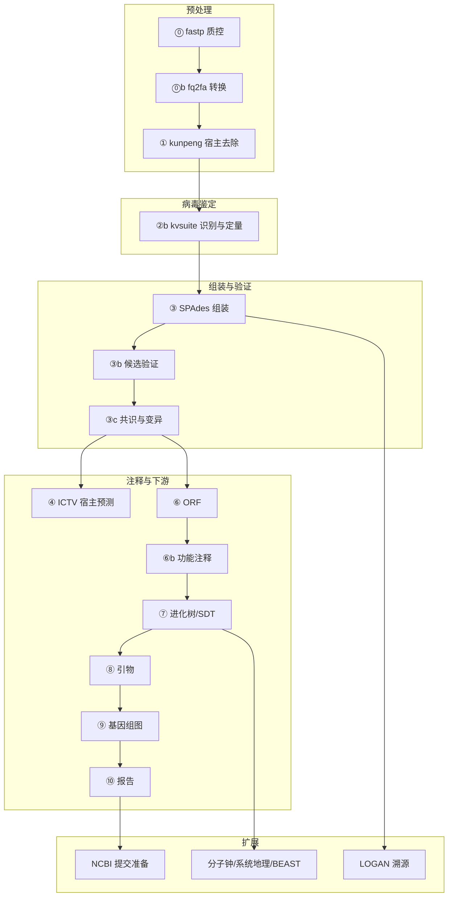

# 🌿 VirusPlatform Wiki — 植物病毒分析平台

基于 **kunpeng**（超低内存宏基因组分类器）的 Windows 本地植物病毒诊断与深度分析平台。
鼠标点击即可完成：**宿主去除 → 已知病毒识别与定量 → 组装 → ORF 预测 → 功能注释 → 进化树 / SDT / 分子钟 / 系统地理 → 引物设计 → 基因组图 → 可视化报告 → 溯源 → NCBI 提交准备**。

本 Wiki 逐模块介绍平台的每一个功能：定位、输入输出、界面入口、CLI、关键参数、产物目录与注意事项。

---

## 📖 页面目录

### 入门

| 页面 | 内容 |
|---|---|
| **[Quick-Start]** | 安装依赖、两种启动模式、首次配置、跑通第一个样品 |
| **[Architecture]** | 平台分层架构、目录结构四层分离、路径兼容、配置 platform.json |
| **[Pipeline-Overview]** | 14 步级联总览、断点续跑、加权进度与剩余时间自学习、资源预估、并发闸门 |

### 主分析管道（样品级 ⓪→⑩）

| 页面 | 内容 |
|---|---|
| **[Preprocess]** | ⓪ fastp 质控 · ⓪b FASTQ→FASTA 转换 · ① kunpeng 宿主去除 |
| **[Kvsuite]** | ②b 已知病毒识别与定量（salmon EM 定量 / minibwa、二次过滤、比对与深度） |
| **[Assembly]** | ③ SPAdes 组装与 contig 分类 · ③b 候选序列验证 · ③c 共识序列与变异 |
| **[Host-Prediction]** | ④ ICTV 宿主概率级联预测 + NCBI 宿主元数据交叉验证、桑基/旭日图 |
| **[ORF]** | ⑥ pyrodigal/pyrodigal-rv ORF 预测 · ⑥b 功能注释（RefSeq 蛋白 + Pfam + CDD 三层） |
| **[Phylo]** | ⑦ 进化树（MAFFT/trimAl + FastTree/RAxML-NG/NJ）· SDT 精确引擎 · MSA 查看 |
| **[Primer]** | ⑧ primer3 引物设计（保守区/全长）、热力学评分、宿主特异性检查 |
| **[Genome-Plots]** | ⑨ 基因组图（gbdraw 圈图/线图、dna_features_viewer 回退、自备文件） |
| **[Report]** | ⑩ 可视化报告（plotly 桑基/旭日、pycirclize、组装指标、全图嵌入） |

### 扩展分析

| 页面 | 内容 |
|---|---|
| **[Phylodynamics]** | 进化动力学工具组：TreeTime ML 分子钟/mugration/天际线、RTT·DRT、BSP、MCC 树、时空降采样、元数据治理、比对 QC |
| **[BEAST]** | BEAST 交接包生成/回读核验、Markov-jump（MJRM）XML 注入与日志解析、MOT 状态解析 |
| **[Phylogeography]** | 系统地理（迁移重构 + 弧线动画 GIF）、RDP5 重组分析、重组前序列预筛 align_qc |
| **[Public-Data]** | 公共数据检索（SRA+GSA 双引擎）、统一元数据 Core14/Full、批量下载（aria2c+sracha）、宿主基因组下载 |
| **[Toolbox]** | 专项工具箱：dsRNA 全链路、miRNA 靶标（5 引擎）、NCBI 参考下载、GenBank 集合/CDS·PEP 提取、MSA 查看、contig 深度注释、单步工具 |
| **[Submission]** | NCBI 提交准备：unified_metadata 一表驱动 → source.src / miuvig / assembly / BioSample / template.sbt |
| **[Logan]** | LOGAN 溯源：Logan-Search 批量提交（SSE 实时进度）、结果导入、溯源报告 |

### 平台设施

| 页面 | 内容 |
|---|---|
| **[Databases]** | 全部数据库与参考库：Taxonomy、kunpeng_db、virusref_db、annot_db、tree_db（plant/ictv）、宿主概率表、宿主库 |
| **[Settings-Ops]** | 设置中心（双语/线程/默认参数/磁盘水位）、任务中心、环境自检、tool_runs 管理、数据库迁移、打包分发 |
| **[CLI-Reference]** | `main.py` 全部 30+ 子命令逐参数速查 |
| **[FAQ]** | 常见问题、已知事项与设计说明（中文路径、大基因组建库、SDT 口径、ML 建树…） |

---

## 🧭 三分钟了解工作流



## 🚀 极简上手

```bat
python app.py                 :: 启动（桌面窗口优先，回退浏览器）
python main.py selfcheck      :: 环境自检
python main.py analyze --r1 R1.fastq.gz --r2 R2.fastq.gz --sample DEMO
```

首次使用请按 **[Quick-Start]** 完成数据库初始化。

---

*Wiki 源文件同步维护于仓库 [`wiki/`](https://github.com/zhangwenda0518/VirusPlatform/tree/main/wiki) 目录。*

[Quick-Start]: https://github.com/zhangwenda0518/VirusPlatform/wiki/Quick-Start
[Architecture]: https://github.com/zhangwenda0518/VirusPlatform/wiki/Architecture
[Pipeline-Overview]: https://github.com/zhangwenda0518/VirusPlatform/wiki/Pipeline-Overview
[Preprocess]: https://github.com/zhangwenda0518/VirusPlatform/wiki/Preprocess
[Kvsuite]: https://github.com/zhangwenda0518/VirusPlatform/wiki/Kvsuite
[Assembly]: https://github.com/zhangwenda0518/VirusPlatform/wiki/Assembly
[Host-Prediction]: https://github.com/zhangwenda0518/VirusPlatform/wiki/Host-Prediction
[ORF]: https://github.com/zhangwenda0518/VirusPlatform/wiki/ORF
[Phylo]: https://github.com/zhangwenda0518/VirusPlatform/wiki/Phylo
[Primer]: https://github.com/zhangwenda0518/VirusPlatform/wiki/Primer
[Genome-Plots]: https://github.com/zhangwenda0518/VirusPlatform/wiki/Genome-Plots
[Report]: https://github.com/zhangwenda0518/VirusPlatform/wiki/Report
[Phylodynamics]: https://github.com/zhangwenda0518/VirusPlatform/wiki/Phylodynamics
[BEAST]: https://github.com/zhangwenda0518/VirusPlatform/wiki/BEAST
[Phylogeography]: https://github.com/zhangwenda0518/VirusPlatform/wiki/Phylogeography
[Public-Data]: https://github.com/zhangwenda0518/VirusPlatform/wiki/Public-Data
[Toolbox]: https://github.com/zhangwenda0518/VirusPlatform/wiki/Toolbox
[Submission]: https://github.com/zhangwenda0518/VirusPlatform/wiki/NCBI-Submission
[Logan]: https://github.com/zhangwenda0518/VirusPlatform/wiki/Logan
[Databases]: https://github.com/zhangwenda0518/VirusPlatform/wiki/Databases
[Settings-Ops]: https://github.com/zhangwenda0518/VirusPlatform/wiki/Settings-Ops
[CLI-Reference]: https://github.com/zhangwenda0518/VirusPlatform/wiki/CLI-Reference
[FAQ]: https://github.com/zhangwenda0518/VirusPlatform/wiki/FAQ
